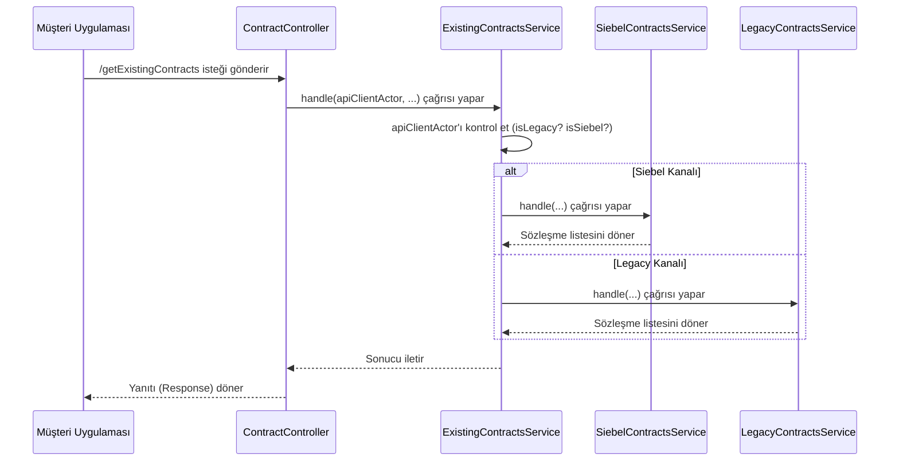

# Chapter 1: Ana Akış ve Yönlendirme


Hoş geldiniz! Bu bölümde, projemizin kalbine bir yolculuk yapacağız ve bir isteğin sistemimize ilk girdiği andan itibaren nasıl bir yol izlediğini keşfedeceğiz.

Uygulamamızı büyük bir şehrin ana trafik kontrol merkezi gibi düşünebilirsiniz. Şehre giren her araç (yani her bir istek) bir hedefe ulaşmak ister. Trafik kontrol merkezinin görevi, aracın kimliğine ve nereden geldiğine bakarak onu en doğru ve en hızlı yoldan hedefine yönlendirmektir. İşte bu bölüm, tam olarak bu "yönlendirme" işleminin nasıl yapıldığını anlatıyor.

Temel senaryomuz şu: Bir müşteri, Vodafone Yanımda uygulaması üzerinden mevcut sözleşmelerini görmek istiyor. Bu basit istek, arka planda nasıl bir maceraya atılıyor? Gelin birlikte görelim.

### Her Şey Nerede Başlıyor? `ContractController`

Her web tabanlı uygulamada olduğu gibi, dış dünyadan gelen tüm istekler ilk olarak bir "Denetleyici" (Controller) tarafından karşılanır. Bizim projemizde bu görev `ContractController`'a aittir. Burası, sistemimizin dış dünyaya açılan kapısıdır.

```java
// Dosya: src/main/java/com/vodafone/mcare/tariffoptions/rest/external/ContractController.java

@RestController
@RequestMapping(value = "/mcare/tariffoptions/contracts")
public class ContractController {

    private final ExistingContractsService existingContractsService;

    // ... constructor ...

    @RequestMapping(value = "/existing", method = {RequestMethod.GET, RequestMethod.POST})
    public ContractListResponse getExistingContracts(
            @RequestAttribute(MsRequestFilter.API_CLIENT_ACTOR_ATTRIBUTE) ApiClientActor apiClientActor,
            @RequestParam(value = "isDetailed", required = false) String isDetailed) {
        // Gelen isteği ana yönlendirme servisine paslar
        return existingContractsService.handle(apiClientActor, isDetailed);
    }
}
```

Bu koda baktığımızda birkaç önemli nokta var:
*   `@RestController`: Bu, Spring Framework'e bu sınıfın web isteklerini dinlediğini söyler.
*   `@RequestMapping`: Bu sınıfın hangi URL adresiyle (`/mcare/tariffoptions/contracts`) çalışacağını belirtir. `getExistingContracts` metodu ise `/existing` uzantısıyla çağrılır.
*   **`ApiClientActor`**: İşte en kritik parça! Bu nesneyi, isteğin "kimlik kartı" gibi düşünebilirsiniz. İçinde, isteği kimin yaptığını (örneğin, Vodafone Yanımda mı, yoksa bir bayi uygulaması mı), hangi dilde konuştuğunu ve güvenlik bilgilerini barındırır. Bu "kimlik kartı", birazdan göreceğimiz yönlendirme kararının temelini oluşturur.
*   **`ExistingContractsService`**: Controller, görevinin sadece isteği karşılamak olduğunu bilir. Asıl işi yapması için topu `ExistingContractsService` adındaki ana servisimize atar.

### Ana Kavşak: `ExistingContractsService`

`ContractController` isteği aldı ve "kimlik kartı" (`ApiClientActor`) ile birlikte `ExistingContractsService`'e gönderdi. İşte şimdi trafik kontrol merkezi devreye giriyor ve en önemli kararı veriyor: Bu istek eski sistemlere mi gitmeli, yoksa yeni nesil sistemlere mi?

```java
// Dosya: src/main/java/com/vodafone/mcare/tariffoptions/service/contract/ExistingContractsService.java

@Service
@RequiredArgsConstructor
public class ExistingContractsService {

    private final LegacyContractsService legacyContractsService;
    private final SiebelContractsService siebelContractsService;

    public ContractListResponse handle(ApiClientActor apiClientActor, String isDetailed) {
        // 1. Kimlik kartına bak: Bu istek eski bir kanaldan mı geliyor?
        if (apiClientActor.isLegacy()) {
            return legacyContractsService.handle(apiClientActor);
        }
        // 2. Yoksa yeni, dijital bir kanaldan mı geliyor?
        if (apiClientActor.isSiebel()) {
            return siebelContractsService.handle(apiClientActor, isDetailed);
        }
        // 3. Eğer ikisi de değilse, bir hata durumu vardır.
        throw new RuntimeException("Uygun servis bulunamadı!");
    }
}
```

Bu kod, projenin ana yönlendirme mantığını çok net bir şekilde özetliyor:

1.  **`apiClientActor.isLegacy()`**: "Kimlik kartı, bu isteğin 'Legacy' (eski) bir kanaldan geldiğini söylüyor mu?" diye kontrol eder. Eğer cevap evet ise, isteği `legacyContractsService`'e yönlendirir.
2.  **`apiClientActor.isSiebel()`**: "Peki, bu istek 'Siebel' (yeni nesil dijital) bir kanaldan mı geliyor?" diye sorar. Cevap evet ise, bu sefer de `siebelContractsService` devreye girer.

Bu basit `if-else` yapısı, projemizin en temel davranışını belirler: isteğin kaynağına göre onu doğru uzmana yönlendirmek.

### Akışın Görsel Hali

Bu yönlendirme mantığını daha iyi anlamak için basit bir diyagrama göz atalım:



Bu diyagram, isteğin ilk giriş noktasından (`ContractController`) ana karar noktasına (`ExistingContractsService`) ve oradan da iki farklı yoldan birine (`SiebelContractsService` veya `LegacyContractsService`) nasıl saptığını gösterir.

### İki Farklı Dünya: Siebel ve Legacy Servisleri

Yönlendiricimiz, isteği iki farklı servisten birine gönderiyor. Peki bu servisler ne iş yapıyor?

1.  **`SiebelContractsService` (Yeni Dünya):**
    Bu servis, Vodafone Yanımda gibi modern, dijital kanallardan gelen istekleri işler. Müşteri verilerini bulmak için birden fazla yeni nesil veri kaynağını (veritabanları, diğer mikroservisler vb.) sorgulayan karmaşık bir mantığa sahiptir. Bu servisin maceralarını bir sonraki bölümde, yani [Sözleşme Veri Kaynağı Zinciri (Siebel Akışı)](02_sözleşme_veri_kaynağı_zinciri__siebel_akışı__.md) konusunda detaylıca inceleyeceğiz.

    ```java
    // Dosya: src/main/java/com/vodafone/mcare/tariffoptions/service/contract/SiebelContractsService.java
    @Service
    public class SiebelContractsService {
        public ContractListResponse handle(ApiClientActor apiClientActor, String isDetailed) {
            // 1. Birden fazla modern kaynaktan sözleşmeleri getir.
            // 2. Gelen "isDetailed" parametresine göre detaylı veya özet yanıt hazırla.
            // 3. Sonucu döndür.
            // ... (detaylar sonraki bölümde)
            return new ContractListResponse();
        }
    }
    ```

2.  **`LegacyContractsService` (Eski Dünya):**
    Bu servis ise daha eski kanallardan (örneğin, bazı iç sistemlerden) gelen istekler için bir geçittir. Görevi, eski ana sistemimiz olan CCB'ye bağlanıp oradan veri almaktır. Ayrıca dikkat ederseniz, bu servis `isDetailed` parametresini kullanmaz, çünkü eski sistemler genellikle bu tür esnekliği desteklemez. Bu servisin nasıl çalıştığını ise [Eski Sistem Sözleşme Akışı (Legacy/CCB)](03_eski_sistem_sözleşme_akışı__legacy_ccb__.md) bölümünde göreceğiz.

    ```java
    // Dosya: src/main/java/com/vodafone/mcare/tariffoptions/service/contract/LegacyContractsService.java
    @Service
    public class LegacyContractsService {
        public ContractListResponse handle(ApiClientActor apiClientActor) {
            // 1. Eski CCB sistemine bağlan.
            // 2. Oradan sözleşmeleri al.
            // 3. Gelen veriyi standart formata çevir ve döndür.
            // ... (detaylar ilgili bölümde)
            return new ContractListResponse();
        }
    }
    ```

### Özet

Bu bölümde projemizin giriş kapısını ve ana trafik yönlendiricisini tanıdık. Öğrendiğimiz en önemli şeyler şunlar:

*   Tüm istekler önce `ContractController` tarafından karşılanır.
*   `ApiClientActor` nesnesi, gelen isteğin kimliğini taşır ve yönlendirme için kritik öneme sahiptir.
*   `ExistingContractsService`, `ApiClientActor`'a bakarak isteğin "Legacy" mi yoksa "Siebel" mi olduğuna karar verir.
*   Bu karara göre istek, ya eski sistemlerle konuşan `LegacyContractsService`'e ya da yeni sistemlerle konuşan `SiebelContractsService`'e yönlendirilir.

Artık bir isteğin sistemimize girdiğinde ilk olarak nasıl bir yol ayrımına geldiğini biliyoruz. Bu, sonraki bölümlerde inceleyeceğimiz daha karmaşık akışları anlamak için sağlam bir temel oluşturuyor.

Sıradaki bölümde, modern dijital kanallardan gelen isteklerin izlediği yolu, yani `SiebelContractsService`'in sözleşme verilerini bulmak için nasıl bir kaynak zinciri kullandığını keşfedeceğiz.

**Sıradaki Bölüm:** [Sözleşme Veri Kaynağı Zinciri (Siebel Akışı)](02_sozlesme_veri_kaynagi_zinciri__siebel_akisi_.md)

---

Generated by [AI Codebase Knowledge Builder](https://github.com/The-Pocket/Tutorial-Codebase-Knowledge)
