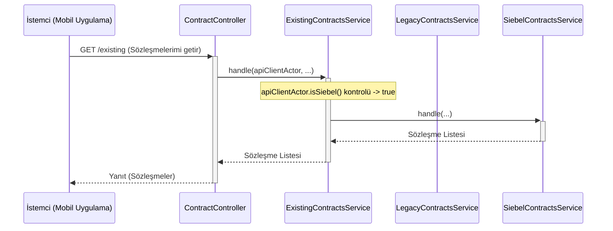

# Chapter 1: İstek Yönlendirme ve Akış Seçimi


Hoş geldiniz! Bu bölümde, `ms-tariff-options` servisinin en temel ve en önemli görevlerinden birini, yani gelen istekleri nasıl bir trafik polisi gibi yönettiğini ve doğru yola yönlendirdiğini öğreneceğiz.

## Neden Bir "Trafik Polisine" İhtiyacımız Var?

Hayal edin ki büyük bir şehre gelen tüm arabaları tek bir kavşakta karşılıyorsunuz. Bazı arabalar şehrin eski, tarihi bölgesine gitmek isterken, diğerleri yeni ve modern iş merkezlerine gitmek istiyor. Eğer bir yönlendirme olmazsa, tam bir kaos yaşanır, değil mi?

İşte bizim servisimiz de tam olarak böyle bir kavşak noktası. Sisteme gelen "mevcut sözleşmelerimi getir" isteği, farklı müşteri tiplerinden gelebilir. Bazı müşterilerimiz eski altyapıyı (`Legacy`) kullanırken, bazıları ise daha modern olan `Siebel` altyapısını kullanır. Servisimizin bu iki farklı müşteri tipine de doğru şekilde hizmet verebilmesi için gelen isteğin kimliğini anlaması ve onu doğru iş akışına yönlendirmesi gerekir.

Bu bölümdeki amacımız, bu "trafik polisi" mekanizmasının nasıl çalıştığını anlamak. Yani bir isteğin yolculuğunun nasıl başladığını ve hangi yola sapacağına nasıl karar verildiğini göreceğiz.

## Ana Kavşak: İki Farklı Dünya

Servisimiz temel olarak iki ana yola ayrılır. Bu yollar, müşterinin hangi sisteme kayıtlı olduğuna göre belirlenir:

1.  **Legacy (CCB) Akışı:** Eski altyapıyı kullanan müşteriler için tasarlanmış yoldur.
2.  **Siebel Akışı:** Yeni ve modern altyapıyı kullanan müşteriler için tasarlanmış yoldur.

Bu ayrımı basit bir şema ile gösterebiliriz:

```mermaid
graph TD
    A["Gelen İstek: Sözleşmelerimi Getir"] --> B{Yönlendirici Servis};
    B -->|Müşteri Eski Sistemde mi?| C[Legacy (CCB) Akışı];
    B -->|Müşteri Yeni Sistemde mi?| D[Siebel Akışı];
```

Peki, sistem bu yönlendirmeyi kodda nasıl yapıyor? Gelin, yolculuğa isteğin ilk girdiği kapıdan başlayalım.

## Adım 1: İsteğin Karşılanması (`ContractController`)

Her şey, dış dünyadan gelen bir isteğin sistemimize ilk ulaştığı yer olan `Controller` katmanında başlar. `ContractController`, bizim dış kapımızdır.

```java
// Dosya: src/main/java/com/vodafone/mcare/tariffoptions/rest/external/ContractController.java

@RestController
@RequestMapping(value = "/mcare/tariffoptions/contracts")
public class ContractController {

    private final ExistingContractsService existingContractsService;

    // ... constructor ...

    @RequestMapping(value = "/existing", method = {RequestMethod.GET, RequestMethod.POST})
    public ContractListResponse getExistingContracts(
        @RequestAttribute(...) ApiClientActor apiClientActor,
        @RequestParam(...) String isDetailed) {
        
        return existingContractsService.handle(apiClientActor, isDetailed);
    }
}
```

Bu kodda dikkat etmemiz gereken birkaç önemli nokta var:

*   `@RequestMapping(value = "/existing", ...)`: Bu satır, `/mcare/tariffoptions/contracts/existing` adresine gelen isteklerin bu metoda düşeceğini belirtir.
*   `ApiClientActor apiClientActor`: İşte sihirli parça bu! `apiClientActor` nesnesi, isteği yapan kullanıcının kimliğini (eski sistem mi, yeni sistem mi vb.) içinde barındıran bir tür "kimlik kartı"dır.
*   `existingContractsService.handle(...)`: `Controller`'ın tek görevi isteği karşılamak ve hemen ardından işi asıl yapacak olan `ExistingContractsService`'e devretmektir.

`Controller` bir resepsiyonist gibidir: Gelen misafiri (`istek`) karşılar, kimliğine (`ApiClientActor`) bakar ve onu doğru odaya (`ExistingContractsService`) yönlendirir.

## Adım 2: Kavşak Noktası ve Karar Anı (`ExistingContractsService`)

Şimdi geldik ana kavşak noktamıza, yani trafik polisinin görev yaptığı yere: `ExistingContractsService`. Bu servis, `ApiClientActor` kimlik kartını kullanarak hangi yolun seçileceğine karar verir.

```java
// Dosya: src/main/java/com/vodafone/mcare/tariffoptions/service/contract/ExistingContractsService.java

@Service
@RequiredArgsConstructor
public class ExistingContractsService {

    private final LegacyContractsService legacyContractsService;
    private final SiebelContractsService siebelContractsService;

    public ContractListResponse handle(ApiClientActor apiClientActor, String isDetailed) {
        if (apiClientActor.isLegacy()) {
            // Eğer kimlik "Legacy" diyorsa, Legacy servisine yönlendir.
            return legacyContractsService.handle(apiClientActor);
        }
        if (apiClientActor.isSiebel()) {
            // Eğer kimlik "Siebel" diyorsa, Siebel servisine yönlendir.
            return siebelContractsService.handle(apiClientActor, isDetailed);
        }
        // Eğer kimlik kartı geçerli değilse, bir hata fırlat.
        throw ...;
    }
}
```

Bu kod, projenin en temel mantık dallanmasını içerir ve son derece basittir:

*   `apiClientActor.isLegacy()`: "Bu müşteri eski sistemden mi geliyor?" diye kontrol eder. Cevap evet ise, topu `legacyContractsService`'e atar.
*   `apiClientActor.isSiebel()`: "Bu müşteri yeni sistemden mi geliyor?" diye kontrol eder. Cevap evet ise, topu `siebelContractsService`'e atar.

İşte bu kadar! Bu basit `if` koşulları sayesinde, sistemimiz gelen her isteği doğru iş akışına hatasız bir şekilde yönlendirir.

### Akışın Tamamı Nasıl İşliyor?

Bu süreci daha iyi anlamak için bir örnek üzerinden adım adım ilerleyelim ve bir şema ile görselleştirelim. Diyelim ki yeni sisteme (`Siebel`) kayıtlı bir müşteri, mobil uygulama üzerinden sözleşmelerini görmek istiyor.

1.  **İstemci (Mobil Uygulama):** Kullanıcı "Sözleşmelerim" butonuna tıklar ve uygulama `/existing` adresine bir istek gönderir.
2.  **ContractController:** İsteği karşılar. Sistemin güvenlik katmanları, isteği yapan kullanıcının kimliğini analiz eder ve `apiClientActor` nesnesini oluşturur. Bu nesnenin içinde kullanıcının "Siebel" müşterisi olduğu bilgisi yer alır.
3.  **ExistingContractsService:** `Controller`, bu `apiClientActor` nesnesi ile `handle` metodunu çağırır.
4.  **Karar Anı:** `handle` metodu içindeki `if (apiClientActor.isSiebel())` kontrolü `true` (doğru) sonucunu verir.
5.  **Yönlendirme:** Kod, `siebelContractsService.handle(...)` metodunu çalıştırır ve istek, Siebel akışına doğru yolculuğuna devam eder.

Bu akışı bir şema üzerinde görelim:



Gördüğünüz gibi, `ExistingContractsService` isteği doğru yola saptıran bir makas görevi görüyor.

### İki Yolun Başlangıcı

Peki, `legacyContractsService` ve `siebelContractsService` ne yapıyor? Onlar da kendi dünyalarının uzmanlarıdır.

*   `LegacyContractsService`: Eski sistemlerle (CCB) nasıl konuşulacağını bilir ve verileri oradan alır.

    ```java
    // LegacyContractsService.java'dan bir kesit
    public ContractListResponse handle(ApiClientActor apiClientActor) {
        // ...
        // Eski CCB sistemine bir SOAP çağrısı yapar
        WS850Response ws850Response = ccbServiceClient.getWS850Response(msisdn, channel);
        // ...
    }
    ```

*   `SiebelContractsService`: Yeni sistemlerle (Siebel) nasıl konuşulacağını bilir ve verileri oradan çeker.

    ```java
    // SiebelContractsService.java'dan bir kesit
    public ContractListResponse handle(ApiClientActor apiClientActor, String isDetailed) {
        // ...
        // Yeni Siebel sisteminden verileri çeker
        List<SiebelContract> siebelContracts = siebelContractSourceChain.fetch(apiClientActor, siebelCallContext);
        // ...
    }
    ```

Bu iki farklı yolu ve nasıl çalıştıklarını ilerleyen bölümlerde çok daha detaylı bir şekilde inceleyeceğiz. Şimdilik bilmemiz gereken, her birinin kendi uzmanlık alanına odaklandığı ve yönlendirici sayesinde doğru zamanda devreye girdikleridir.

## Özet ve Sonraki Adım

Bu bölümde, projemizin temel taşlarından birini öğrendik:

*   Sisteme gelen tüm "mevcut sözleşmeleri getir" istekleri tek bir kapıdan (`ContractController`) girer.
*   `ExistingContractsService` adında bir "trafik polisi" veya "yönlendirici" bulunur.
*   Bu yönlendirici, isteği yapanın kimliğine (`ApiClientActor`) bakarak isteği ya `Legacy` ya da `Siebel` yoluna yönlendirir.
*   Bu basit ama etkili yapı sayesinde, farklı müşteri tipleri için tamamen farklı iş akışları çalıştırılabilir.

Artık bir isteğin sisteme girdikten sonra hangi yola gideceğine nasıl karar verildiğini biliyoruz. Peki bu yolların içinde neler oluyor?

Bir sonraki bölümde, bu yollardan ilkine, yani eski sistemler için olan akışa daha yakından bakacağız.

[Sonraki Bölüm: Legacy (CCB) Akışı](02_legacy__ccb__akışı_.md)

---

Generated by [AI Codebase Knowledge Builder](https://github.com/The-Pocket/Tutorial-Codebase-Knowledge)
