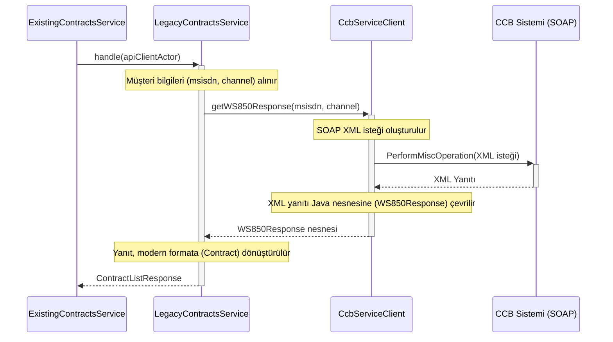

# Chapter 2: Legacy (CCB) Akışı


Önceki bölümde, uygulamamızın bir "trafik polisi" gibi çalışarak gelen istekleri nasıl doğru yollara yönlendirdiğini öğrendik. `ExistingContractsService`'in, müşterinin kimliğine bakarak onu ya modern `Siebel` yoluna ya da bu bölümde inceleyeceğimiz `Legacy (CCB)` yoluna nasıl sevk ettiğini gördük.

[Önceki Bölüm: İstek Yönlendirme ve Akış Seçimi](01_i̇stek_yönlendirme_ve_akış_seçimi_.md)

Şimdi, trafik polisinin eski sistem müşterilerini yönlendirdiği o tarihi yola gireceğiz. Bu yolculukta, uygulamamızın geçmişle nasıl konuştuğunu ve eski teknolojileri kullanarak nasıl veri aldığını keşfedeceğiz.

## Neden Geçmişe Bir Kapı Açmalıyız?

Her büyük ve köklü sistemin bir geçmişi vardır. Bizim sistemimizde de bazı müşteriler, teknolojinin daha farklı olduğu eski bir altyapıya, yani **CCB** (Customer Care and Billing) sistemine kayıtlıdır. Modern `Siebel` sisteminin aksine, bu eski sistem tamamen farklı bir dil konuşur: **SOAP XML**.

Legacy (CCB) akışının temel amacı, bu eski dilden anlayan bir "tercüman" görevi görerek sistemin geriye dönük uyumlu olmasını sağlamaktır. Böylece, müşterinin hangi sistemde kayıtlı olduğunun bir önemi kalmaz; her müşteri kendi sözleşme bilgilerine sorunsuzca ulaşabilir.

Bu akışı bir arkeoloğun çalışmasına benzetebiliriz. Arkeolog, eski bir haritayı (istek) alır, antik bir kente (CCB sistemi) gider, oradaki yazıtları (XML yanıtı) okur ve bulgularını günümüz diline (modern veri formatı) çevirerek raporlar.

## Ana Karakter: `LegacyContractsService`

Bu tarihi yolculuğun rehberi `LegacyContractsService` sınıfıdır. Bir önceki bölümde `ExistingContractsService` tarafından yönlendirilen istek, ilk olarak bu servise gelir. Görevi oldukça nettir:

1.  Müşteri bilgilerini al.
2.  Eski CCB sistemiyle konuşması için uzman bir servisi görevlendir.
3.  Gelen "antik" dildeki yanıtı, herkesin anlayabileceği modern bir formata çevir.

Gelin, bu servisin gelen isteği nasıl ele aldığını kod üzerinde görelim.

```java
// Dosya: src/main/java/com/vodafone/mcare/tariffoptions/service/contract/LegacyContractsService.java

@Service
public class LegacyContractsService {

    private final CcbServiceClient ccbServiceClient;
    // ... diğer bağımlılıklar

    public ContractListResponse handle(ApiClientActor apiClientActor) {
        // Müşterinin telefon numarası, kullandığı kanal gibi bilgiler alınır.
        String msisdn = apiClientActor.getClientActor().getUser().getSubscriber().getMsisdn();
        String channel = apiClientActor.getClientActor().getChannel();
        
        // Yapılandırmaya göre hangi CCB servisini kullanacağımıza karar veririz.
        if (contractProperties.isUseCcb850()) {
            return handleCcb850(msisdn, channel, ...);
        }
        return handleCcb680(msisdn, channel, ...);
    }
}
```

Bu kodda iki önemli nokta var:

*   **`handle` metodu:** Bu, Legacy akışının başlangıç noktasıdır. Yönlendiriciden gelen isteği ilk o karşılar.
*   **`if (contractProperties.isUseCcb850())`:** Bu satır, sistemin ne kadar esnek olduğunu gösterir. CCB ile konuşmanın bile birden fazla yolu ("850" ve "680" adında iki farklı servis) olabilir. Hangi yolun kullanılacağına dışarıdan bir [yapılandırma dosyası](06_yapılandırma__configuration__odaklı_davranış_.md) ile karar verilir. Bu, kodu değiştirmeden sistemin davranışını değiştirmemizi sağlar.

## Tercümanla Tanışın: `CcbServiceClient`

`LegacyContractsService` hangi yoldan gideceğine karar verdi, peki CCB ile kim konuşacak? İşte bu noktada devreye uzman tercümanımız, yani `CcbServiceClient` girer. Bu servis, eski sistemin konuştuğu SOAP XML dilini çok iyi bilir.

`LegacyContractsService`'in, bu tercümanı nasıl göreve çağırdığına bakalım:

```java
// Dosya: src/main/java/com/vodafone/mcare/tariffoptions/service/contract/LegacyContractsService.java

private ContractListResponse handleCcb850(String msisdn, String channel, String languageId) {
    // Tercümana "Bu müşteri için sözleşmeleri getir" diyoruz.
    WS850Response ws850Response = ccbServiceClient.getWS850Response(msisdn, channel);

    // Tercümanın getirdiği eski formattaki yanıtı modern formata çeviriyoruz.
    // ... assembler kullanarak çevirme işlemi ...
    
    return ...; // Modern formatta yanıtı döndür
}
```

Gördüğünüz gibi, `LegacyContractsService` işin zor kısmını uzmanına bırakıyor. Kendisi SOAP veya XML detaylarıyla hiç uğraşmıyor, sadece `ccbServiceClient`'e ne istediğini söylüyor.

## Antik Dilde Mesajlaşma: SOAP XML İsteği Nasıl Oluşturulur?

Peki tercümanımız `CcbServiceClient` bu işi nasıl yapıyor? Aslında yaptığı şey, belirli bir şablona göre eski usul bir "mektup" (XML isteği) hazırlamaktır.

```java
// Dosya: src/main/java/com/vodafone/mcare/tariffoptions/extcall/soap/ccb/CcbServiceClientImpl.java

// Bu, CCB sistemine göndereceğimiz XML "mektubunun" şablonu.
private static final ResolvableString xml850GetCommitmentCampaigns = new ResolvableString(
        "<root><header><servicecode>850</servicecode><channel>${channel}</channel><gsmno>${gsmno}</gsmno>...</header>...</root>");

@Override
public WS850Response getWS850Response(String msisdn, String channel) {
    // Mektuptaki boşlukları doldurmak için parametreleri hazırlıyoruz.
    Map<String, String> params = new HashMap<>();
    params.put("channel", ...);
    params.put("gsmno", ...);

    // Şablonu kullanarak son mektubu (XML) oluşturuyoruz.
    String inputXml = xml850GetCommitmentCampaigns.resolveJstl(params);
    
    // Oluşturduğumuz bu XML'i CCB sistemine gönderiyoruz.
    return callMiscOperation("Ws850", params, inputXml, ws850xmlParser);
}
```

Bu süreç, bir form doldurmaya çok benzer:
1.  Elimizde boş bir form (`xml850GetCommitmentCampaigns`) var.
2.  Formdaki `${channel}` ve `${gsmno}` gibi boşlukları müşteri bilgileriyle dolduruyoruz.
3.  Doldurduğumuz bu formu (yani `inputXml`) CCB sistemine gönderiyoruz.
4.  CCB sistemi de bize yine XML formatında bir yanıt veriyor. `CcbServiceClient` bu yanıtı alıp `WS850Response` adında daha kolay işlenebilir bir Java nesnesine dönüştürüyor.

## Legacy Akışının Tam Yolculuğu

Tüm bu adımları bir araya getirdiğimizde ortaya çıkan yolculuğu bir şema ile görelim:



Bu şema, Legacy akışının ne kadar basit ve doğrusal olduğunu gösterir. Modern `Siebel` akışındaki gibi karmaşık bir zincir yapısı yerine, adım adım ilerleyen net bir süreç vardır.

## Yanıtın Modernleştirilmesi

Yolculuğun son adımı, CCB'den gelen eski formattaki verinin modern ve standart bir formata (`Contract`) dönüştürülmesidir. Bu işlem, bir "çevirmen" olan `ContractAssembler` tarafından yapılır. Bu sayede, verinin Legacy'den mi yoksa Siebel'den mi geldiği, uygulamanın geri kalanı için bir önem taşımaz. Her iki yolun sonunda da aynı tipte, standart bir yanıt üretilir. Bu konuyu [Yanıt (Response) Oluşturma ve Zenginleştirme](05_yanıt__response__oluşturma_ve_zenginleştirme_.md) bölümünde daha detaylı inceleyeceğiz.

```java
// Dosya: src/main/java/com/vodafone/mcare/tariffoptions/service/contract/LegacyContractsService.java

// CCB'den gelen her bir kampanya bilgisi için...
for (CommitmentCampaign commitmentCampaign : ws850Response.getCommitmentCampaignList()) {
    // Assembler'ı kullanarak eski veriyi yeni formata çevir.
    Contract.Builder contract = contractAssembler.prepareContractForLegacyFor850(commitmentCampaign, languageId);
    
    // ...
    allContracts.addContract(contract.build());
}
```

## Özet ve Sonraki Adım

Bu bölümde, sistemimizin eski CCB sistemiyle nasıl konuştuğunu öğrendik:

*   **Legacy (CCB) akışı**, eski altyapıya kayıtlı müşterilere hizmet vermek için vardır ve sistemin geriye dönük uyumluluğunu sağlar.
*   Yolculuk `LegacyContractsService` ile başlar. Bu servis, isteği yönetir.
*   Asıl iletişim, SOAP XML dilini konuşan `CcbServiceClient` tarafından gerçekleştirilir.
*   Bu servis, bir XML şablonu doldurarak CCB sistemine istek gönderir.
*   Gelen eski formattaki yanıt, `ContractAssembler` ile modern bir formata dönüştürülerek yolculuk tamamlanır.

Eski kentin sokaklarında nasıl gezineceğimizi öğrendiğimize göre, şimdi yönümüzü modern dünyanın gökdelenlerine çevirebiliriz. Bir sonraki bölümde, `Siebel` akışının nasıl çalıştığını ve çok daha karmaşık olan "veri kaynağı zinciri" mimarisini keşfedeceğiz.

[Sonraki Bölüm: Siebel Veri Kaynağı Zinciri](03_siebel_veri_kaynağı_zinciri_.md)

---

Generated by [AI Codebase Knowledge Builder](https://github.com/The-Pocket/Tutorial-Codebase-Knowledge)