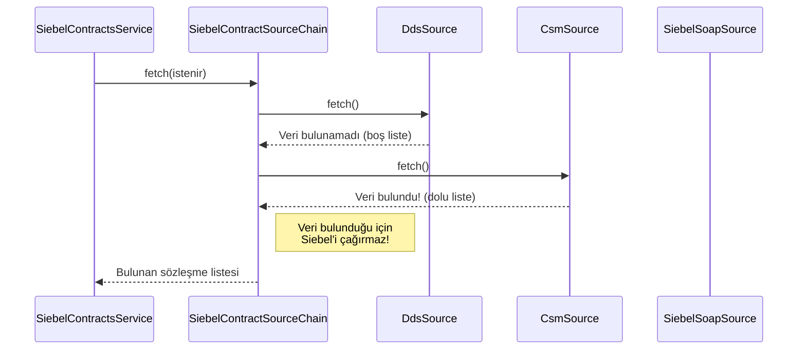

# Chapter 2: Sözleşme Veri Kaynağı Zinciri (Siebel Akışı)


Önceki bölüm olan [Ana Akış ve Yönlendirme](01_ana_akış_ve_yönlendirme_.md) konusunda, sistemimize gelen bir isteğin nasıl analiz edilip `SiebelContractsService`'e yönlendirildiğini gördük. Artık yolculuğumuzun ikinci etabına, yani "yeni nesil" dijital kanallardan gelen isteklerin sözleşme verisini nasıl bulduğuna odaklanabiliriz.

Peki, `SiebelContractsService` bu bilgiyi nereden buluyor? Tek bir "doğru" kaynak mı var? Ya o kaynak yavaşsa veya geçici olarak çalışmıyorsa? İşte bu bölümde, projemizin bu soruna karşı geliştirdiği akıllı ve esnek çözümü, yani "Veri Kaynağı Zinciri" yapısını inceleyeceğiz.

### Problem: Veriyi Hızlı ve Güvenilir Bir Şekilde Nereden Buluruz?

Bir müşterinin sözleşmelerini getirmek basit bir görev gibi görünebilir, ancak arka planda bu verinin yaşayabileceği birkaç farklı yer vardır.

*   **Hızlı Önbellek (Cache):** Sık erişilen verileri saklayan çok hızlı bir veritabanı.
*   **Modern Servisler:** Veriyi daha yapısal sunan yeni nesil mikroservisler.
*   **Ana Kaynak (Legacy Sistem):** En güvenilir ama genellikle en yavaş olan, her bilginin kesin olarak bulunduğu ana sistem.

Eğer her seferinde en yavaş ama en güvenilir olan ana kaynağa gidersek, uygulamamız yavaş çalışır ve kullanıcı deneyimi kötüleşir. Sadece en hızlı kaynağa güvenirsek, orada olmayan veya güncel olmayan bir veriyle karşılaşabiliriz.

Çözümümüz, bu kaynakları bir "zincir" gibi birbirine bağlayarak akıllı bir arama stratejisi oluşturmaktır. Tıpkı bir hazine avcısı gibi, sistemimiz de sözleşme verisini bulmak için en olası ve en hızlı yerden başlayarak sırayla tüm kaynakları dener.

### Ana Orkestra Şefi: `SiebelContractSourceChain`

Bu akıllı arama stratejisini yöneten ana bileşenin adı `SiebelContractSourceChain`. Bu sınıf, bir orkestra şefi gibi davranır: hangi enstrümanın (veri kaynağının) ne zaman çalacağına karar verir.

Görevi çok basittir:
1.  Önceden belirlenmiş bir sıraya göre veri kaynaklarını tek tek çağırır.
2.  Veriyi **ilk bulan** kaynaktan aldığı sonuçla geri döner.
3.  Bir kaynak veri bulursa, zincirin geri kalanını çalıştırmaz ve aramayı sonlandırır.

Bu davranış, sistemin verimliliği için kritik öneme sahiptir. Gelin bu sınıfın en önemli metoduna bakalım:

```java
// Dosya: src/main/java/com/vodafone/mcare/tariffoptions/service/contract/SiebelContractSourceChain.java

public List<SiebelContract> fetch(ApiClientActor apiClientActor, SiebelCallContext siebelCallContext) {
    // 1. Hangi sırada arama yapacağımızı belirle.
    List<SiebelContractSourceType> order = resolveOrder();

    // 2. Belirlenen sırada kaynakları tek tek dene.
    for (SiebelContractSourceType type : order) {
        SiebelContractSource source = sourceByType.get(type);
        // ... kaynak destekleniyor mu kontrolü ...
        
        List<SiebelContract> contracts = source.fetch(apiClientActor, siebelCallContext);
        
        // 3. Eğer bu kaynak dolu bir liste döndürdüyse, aramayı bitir ve sonucu dön!
        if (!CollectionUtils.isEmpty(contracts)) {
            return contracts;
        }
    }
    // 4. Hiçbir kaynak veri bulamadıysa, boş liste dön.
    return List.of();
}
```

Bu koddaki en önemli mantık `if (!CollectionUtils.isEmpty(contracts))` satırıdır. Bir kaynak (örneğin en hızlı olan DDS) sonuç bulduğu anda, döngü kırılır ve bulunan veri anında geri döndürülür. Diğer yavaş kaynaklar hiç çağrılmaz.

### Zincirin Sırasını Kim Belirliyor? Yapılandırma Dosyası

Bu zincirin en güzel yanlarından biri, kaynakların sırasının kodun içinde sabit olmamasıdır. Hangi kaynağın önce deneneceğini `application.yml` dosyasındaki basit bir konfigürasyonla yönetebiliriz.

```yaml
# Dosya: src/main/resources/application.yml

contract-properties:
  # ... diğer ayarlar ...
  siebel-source-order:
    - dds
    - csm
    - tmf651
    - siebel_soap
```

Bu yapılandırma, `SiebelContractSourceChain`'e şu emri verir:
1.  **Önce `dds`'e git:** Bu, DDS (Mongo veritabanı) adındaki hızlı önbelleğimizdir.
2.  **Orada bulamazsan `csm`'e git:** Bu, başka bir modern servistir.
3.  **Hala bulamadıysan `tmf651`'i dene:** Bu da başka bir mikroservis entegrasyonudur.
4.  **En son çare olarak `siebel_soap`'a git:** Bu, en eski ve en yavaş ama ana veri kaynağımız olan Siebel SOAP servisidir.

Eğer bir gün DDS kaynağını geçici olarak devre dışı bırakmak istersek, tek yapmamız gereken bu listeden `dds` satırını silmektir. Kodda hiçbir değişiklik yapmamıza gerek kalmaz!

### Zincirin Halkaları: `SiebelContractSource` Arayüzü

Zinciri oluşturan her bir "halka" (veri kaynağı), ortak bir kural setine uymak zorundadır. Bu kurallar `SiebelContractSource` adında bir arayüz (interface) ile tanımlanır. Bu, her veri kaynağının aynı dili konuşmasını sağlar.

```java
// Dosya: src/main/java/com/vodafone/mcare/tariffoptions/service/contract/siebel/source/SiebelContractSource.java

public interface SiebelContractSource {
    // Bu kaynak şu an aktif mi? (Yapılandırmadan kontrol eder)
    boolean supports();

    // Bu kaynağın adı ne? (Örn: DDS, CSM)
    SiebelContractSourceType getType();

    // Git ve veriyi getir!
    List<SiebelContract> fetch(ApiClientActor apiClientActor, SiebelCallContext siebelCallContext);
}
```

Şimdi bu arayüzü kullanan birkaç somut "halka" örneğine bakalım:

#### 1. Halka: `DdsSiebelContractSource` (En Hızlı)

Bu, zincirdeki ilk ve en hızlı halkadır. Görevi, veriyi DDS (Mongo) veritabanından almaktır.

```java
// Dosya: src/main/java/com/vodafone/mcare/tariffoptions/service/contract/siebel/source/DdsSiebelContractSource.java

@Component
@RequiredArgsConstructor
public class DdsSiebelContractSource implements SiebelContractSource {

    private final DdsDao ddsDao;
    private final ContractProperties contractProperties;

    @Override
    public boolean supports() {
        // application.yml'deki 'use-dds' ayarı true ise çalışır.
        return contractProperties.isUseDds();
    }
    
    // ... getType() metodu ...

    @Override
    public List<SiebelContract> fetch(...) {
        // Veritabanından (DDS) aktif sözleşmeleri bul ve getir.
        return ddsDao.findActiveAgreements(apiClientActor.getLoggedInSubscriberMsisdn());
    }
}
```

#### 2. ve 3. Halkalar: `CsmSiebelContractSource` ve `Tmf651SiebelContractSource` (Modern Servisler)

Eğer DDS'te veri bulunamazsa, zincir CSM ve TMF651 gibi diğer modern servislere istek atan halkalara geçer. Bu halkalar da aynı `SiebelContractSource` arayüzünü uygularlar.

#### Son Halka: `SiebelSoapContractSource` (Ana Kaynak)

Eğer önceki tüm hızlı ve modern kaynaklarda veri bulunamazsa, zincir en son ve en güvenilir halkaya ulaşır: ana Siebel sistemine doğrudan SOAP isteği atan kaynak. Bu en yavaş olanıdır, bu yüzden en sona bırakılır.

```java
// Dosya: src/main/java/com/vodafone/mcare/tariffoptions/service/contract/siebel/source/SiebelSoapContractSource.java

@Component
@RequiredArgsConstructor
public class SiebelSoapContractSource implements SiebelContractSource {

    private final SiebelServiceClient siebelServiceClient;

    @Override
    public boolean supports() {
        // Bu kaynak her zaman aktiftir, bir 'fallback' (son çare) görevi görür.
        return true; 
    }

    // ... getType() metodu ...

    @Override
    public List<SiebelContract> fetch(...) {
        // Ana Siebel sistemine bağlan ve oradan sözleşmeleri al.
        return siebelServiceClient.getActiveAgreements(...);
    }
}
```

### Akışın Görsel Hali

Bu zincir mekanizmasının nasıl çalıştığını bir diyagramla daha net görebiliriz. Diyagramda, verinin DDS'te bulunamadığı ama CSM'de bulunduğu bir senaryoyu canlandıralım:



Gördüğünüz gibi, `SiebelContractSourceChain`, CSM'den geçerli bir yanıt aldığı anda aramayı durdurdu ve en yavaş kaynak olan Siebel'e hiç gitmedi. Bu, sistemimizin performansını ciddi şekilde artıran bir stratejidir.

### Özet

Bu bölümde, yeni nesil dijital kanallar için sözleşme verilerini nasıl akıllıca ve verimli bir şekilde getirdiğimizi öğrendik:

*   **Zincir Mimarisi:** Sistem, veriyi bulmak için "Chain of Responsibility" (Sorumluluk Zinciri) adı verilen bir tasarım deseni kullanır.
*   **`SiebelContractSourceChain`:** Bu sınıf, veri kaynaklarını belirli bir sırada çağıran ve ilk başarılı sonucu döndüren bir orkestra şefidir.
*   **Yapılandırılabilirlik:** Zincirin sırası, `application.yml` dosyasından kolayca değiştirilebilir, bu da bize esneklik sağlar.
*   **Ortak Arayüz:** Zincirdeki her halka (`Dds`, `Csm`, `SiebelSoap` vb.), `SiebelContractSource` arayüzünü uygulayarak standart bir şekilde davranır.
*   **Önce Hız:** Strateji, "en hızlıdan en yavaşa" doğru çalışarak gereksiz yere yavaş sistemleri meşgul etmeyi önler ve kullanıcıya hızlı yanıt dönmeyi hedefler.

Artık modern kanalların veri avlama stratejisini anladığımıza göre, bir sonraki bölümde madalyonun diğer yüzüne bakacağız: `ExistingContractsService`'in yönlendirdiği ikinci yol olan eski sistemlerin akışı nasıl işliyor?

**Sıradaki Bölüm:** [Eski Sistem Sözleşme Akışı (Legacy/CCB)](03_eski_sistem_sözleşme_akışı__legacy_ccb__.md)

---

Generated by [AI Codebase Knowledge Builder](https://github.com/The-Pocket/Tutorial-Codebase-Knowledge)