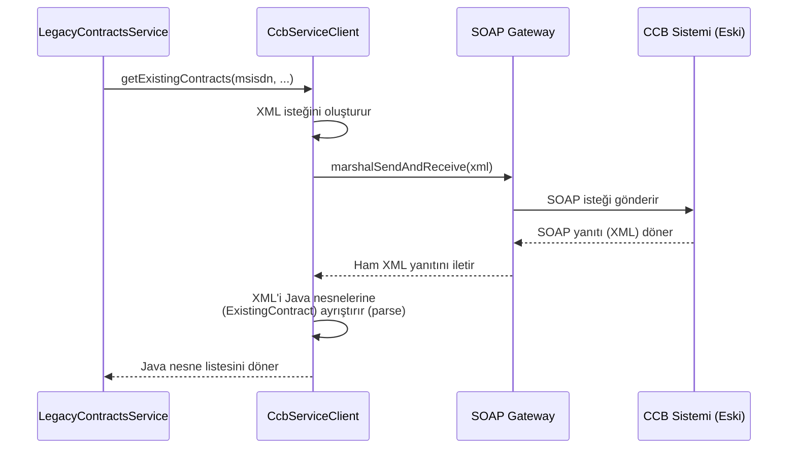

# Chapter 3: Eski Sistem Sözleşme Akışı (Legacy/CCB)


[Ana Akış ve Yönlendirme](01_ana_akış_ve_yönlendirme_.md) bölümünde, uygulamamıza gelen bir isteğin nasıl bir yol ayrımına geldiğini gördük. Eğer istek, eski bir kanaldan geliyorsa, `ExistingContractsService` onu `LegacyContractsService`'e yönlendiriyordu. [Sözleşme Veri Kaynağı Zinciri (Siebel Akışı)](02_sözleşme_veri_kaynağı_zinciri__siebel_akışı__.md) bölümünde ise modern dünyanın karmaşık veri toplama sürecini inceledik.

Şimdi ise zamanda geriye giderek madalyonun diğer yüzüne bakacağız: Eski ana sistemimizle konuşan, kendi içine kapalı ve özel bir dünyaya adım atacağız. Bu bölüm, projemizin eski ve köklü sistemlerle nasıl iletişim kurduğunu, adeta bir "tercüman" gibi davranarak onlardan nasıl bilgi aldığını anlatıyor.

### Problem: Antik Bir Dille Konuşmak

Modern sistemler genellikle JSON formatında veri alışverişi yapar ve REST API'ler üzerinden konuşur. Ancak büyük kurumlarda, yıllardır çalışan ve işin temelini oluşturan "eski" ana sistemler bulunur. Bizim projemizdeki bu sistemin adı **CCB** (Customer Care and Billing).

CCB, modern sistemlerden farklı bir dil konuşur: **XML**. İletişim kurmak için de farklı bir protokol kullanır: **SOAP**. Bu durum, bizi şu soruyla karşı karşıya bırakır: Yeni nesil Java uygulamamız, bu eski ve farklı kurallara sahip sistemle nasıl anlaşacak?

İşte `LegacyContractsService` ve onun yardımcıları tam da bu noktada devreye girer. Onların görevi, CCB ile aramızda bir köprü kurmak, modern dünyadan gelen isteği CCB'nin anlayacağı antik dile çevirmek ve ondan gelen cevabı tekrar modern dünyaya tercüme etmektir.

### Ana Kapı: `LegacyContractsService`

Eski dünyaya açılan kapımız `LegacyContractsService`'tir. `ExistingContractsService`, bir isteğin "legacy" olduğuna karar verdiğinde, görevi bu servise devreder. Bu servis, akışın ilk orkestra şefidir.

```java
// Dosya: src/main/java/com/vodafone/mcare/tariffoptions/service/contract/LegacyContractsService.java

@Service
@RequiredArgsConstructor
public class LegacyContractsService {

    private final CcbServiceClient ccbServiceClient;
    private final ContractAssembler contractAssembler;
    private final ContractProperties contractProperties;
    // ...

    public ContractListResponse handle(ApiClientActor apiClientActor) {
        String msisdn = //... Müşteri numarası alınır
        String channel = //... Kanal bilgisi alınır
        
        // application.yml dosyasından gelen bir ayara göre hangi CCB servisini
        // kullanacağımıza karar veriyoruz.
        if (contractProperties.isUseCcb850()) {
            return handleCcb850(msisdn, channel, languageId);
        }
        return handleCcb680(msisdn, channel, languageId);
    }
}
```

Bu kodda dikkat çeken ilk şey, `isUseCcb850` kontrolüdür. Bu, eski dünyanın bile kendi içinde farklı versiyonları veya metotları olabileceğini gösterir. Bir yapılandırma dosyası (`application.yml`) üzerinden, CCB'nin `850` kodlu servisine mi yoksa `680` kodlu servisine mi gideceğimize karar verebiliriz. Bu bize büyük bir esneklik sağlar.

### Baş Tercüman: `CcbServiceClient`

`LegacyContractsService` kararı verdikten sonra, asıl "tercüme" ve "iletişim" işini yapması için topu `CcbServiceClient`'e atar. Bu bileşen, CCB ile iletişim kurmanın tüm teknik detaylarını üstlenir.

Görevi üç ana adıma ayrılır:
1.  **İsteği Hazırla:** CCB'nin anlayacağı dilde (XML) bir sorgu metni oluştur.
2.  **Gönder ve Dinle:** Bu XML'i SOAP protokolü üzerinden CCB'ye gönder ve yanıtını bekle.
3.  **Yanıtı Çevir:** Gelen XML yanıtını, Java'nın anlayabileceği nesnelere dönüştür.

Gelin bu adımları daha yakından inceleyelim.

#### 1. Adım: XML Sorgusunu Oluşturmak

CCB'ye "Bu müşterinin sözleşmelerini ver" demek için, ona özel formatta bir XML göndermemiz gerekir. Bu XML'ler, kodumuzda birer metin şablonu olarak tutulur.

```java
// Dosya: src/main/java/com/vodafone/mcare/tariffoptions/extcall/soap/ccb/CcbServiceClientImpl.java

// Bu, 680 kodlu servise gönderilecek XML şablonudur.
private static final ResolvableString xml680GetExistingContracts = new ResolvableString(
    "<root>" +
        "<header>" +
            "<servicecode>680</servicecode>" +
            "<gsmno>${gsmno}</gsmno>" + // Müşterinin numarası buraya gelecek
            "<existing_only>TRUE</existing_only>" +
        "</header>" +
        "<data><channel>${channel}</channel></data>" + // İstek yapan kanal buraya gelecek
    "</root>");
```
Burada `${gsmno}` ve `${channel}` gibi yer tutucular, gerçek istekteki müşteri numarası ve kanal bilgisiyle doldurulur. Tıpkı bir mektup şablonundaki boşlukları doldurmak gibi.

#### 2. ve 3. Adım: Gönderme, Alma ve Ayrıştırma

XML hazırlandıktan sonra, `CcbServiceClient` bu mektubu özel bir postacı (SOAP Gateway) aracılığıyla CCB'ye gönderir. Gelen cevabı alır ve bir "XML ayrıştırıcısı" (`XML Parser`) kullanarak okunabilir hale getirir.

```java
// Dosya: src/main/java/com/vodafone/mcare/tariffoptions/extcall/soap/ccb/CcbServiceClientImpl.java

// WS680XMLParser, gelen XML'i Java nesnelerine dönüştüren uzmanımızdır.
private final WS680XMLParser ws680XMLParser = new WS680XMLParser();

public <T extends CcbWsResponse> T callMiscOperation(..., String inputXml, IccbXmlParser<T> parser) {
    PerformMiscOperation request = new PerformMiscOperation();
    request.setXmlVal(inputXml); // 1. Hazırlanan XML isteğe eklenir.

    // 2. Gateway üzerinden istek gönderilir ve yanıt XML olarak alınır.
    PerformMiscOperationResponse opResp = ccbGateway.marshalSendAndReceive(request);
    String respXml = opResp.getPerformMiscOperationReturn();

    // 3. Gelen XML yanıtı, parser kullanılarak Java nesnelerine çevrilir.
    T resp = parser.parseXml(respXml);
    return resp;
}
```
Bu metot, Legacy akışının kalbidir. `ccbGateway.marshalSendAndReceive` satırı ağ üzerinden asıl iletişimin gerçekleştiği yerdir. `parser.parseXml(respXml)` ise gelen anlaşılmaz XML metnini, kodumuzda rahatça kullanabileceğimiz `ExistingContract` gibi Java nesnelerine dönüştürür.

### Akışın Görsel Hali

Bu tercümanlık sürecini bir diyagramla daha net görebiliriz:



### Son Dokunuş: Veriyi Standart Hale Getirmek

`CcbServiceClient`, görevini tamamladı ve CCB'den gelen veriyi `ExistingContract` adında Java nesnelerine çevirdi. Ancak bu nesneler, CCB sisteminin yapısına özgüdür. Bizim uygulamamızın dış dünyaya döndüğü `Contract` nesnesiyle aynı formatta değiller.

İşte bu noktada devreye [Yanıt Oluşturucular (Assemblers)](05_yanıt_oluşturucular__assemblers__.md) girer. `LegacyContractsService`, `ContractAssembler`'ı kullanarak CCB'den gelen ham veriyi, uygulamamızın standart yanıt formatına dönüştürür.

```java
// Dosya: src/main/java/com/vodafone/mcare/tariffoptions/service/contract/LegacyContractsService.java

private List<Contract> mapCcb680Contracts(List<ExistingContract> existingContracts, ...) {
    List<Contract> contractList = new ArrayList<>();
    // ...
    for (ExistingContract existingContract : existingContracts) {
        Contract.Builder contract = Contract.newBuilder();
        // Assembler, CCB'ye özgü 'existingContract' nesnesini
        // standart 'Contract' nesnesine dönüştürür.
        contractAssembler.prepareContractLegacy680(existingContract, contract, languageId);
        contractList.add(contract.build());
    }
    return contractList;
}
```
Bu son adım sayesinde, verinin Siebel akışından mı yoksa Legacy akışından mı geldiği fark etmeksizin, müşteriye her zaman aynı yapıda ve formatta bir yanıt sunmuş oluruz.

### Özet

Bu bölümde, projemizin eski ana sistemimiz CCB ile nasıl konuştuğunu, adeta bir diplomat gibi davranarak farklı diller ve protokoller arasında nasıl köprü kurduğunu öğrendik.

*   **Amaç Geriye Uyumluluktur:** Bu akış, yeni sistemlerin eski ve kritik sistemlerle sorunsuzca çalışmasını sağlar.
*   **`LegacyContractsService` Yönlendirir:** Akışın başlangıç noktasıdır ve hangi CCB operasyonunun kullanılacağına karar verir.
*   **`CcbServiceClient` Konuşur:** XML oluşturma, SOAP ile gönderme ve XML'i ayrıştırma gibi tüm teknik iletişim detaylarını yöneten baş tercümandır.
*   **XML ve SOAP Temel Teknolojilerdir:** Bu akış, modern JSON/REST ikilisinin aksine, eski dünyanın iletişim standartlarını kullanır.
*   **`Assembler`'lar Standartlaştırır:** CCB'den gelen veriyi, uygulamanın genel yanıt formatına çevirerek tutarlılığı sağlarlar.

Artık hem modern Siebel akışının hem de eski CCB akışının sözleşme listelerini nasıl getirdiğini biliyoruz. Peki bu listeler elde edildikten sonra ne oluyor? Farklı kaynaklardan gelen bu sözleşmeler kullanıcıya sunulmadan önce nasıl bir düzene sokuluyor?

**Sıradaki Bölüm:** [Sözleşme Ailesi Sıralama ve Normalleştirme](04_sözleşme_ailesi_sıralama_ve_normalleştirme_.md)

---

Generated by [AI Codebase Knowledge Builder](https://github.com/The-Pocket/Tutorial-Codebase-Knowledge)