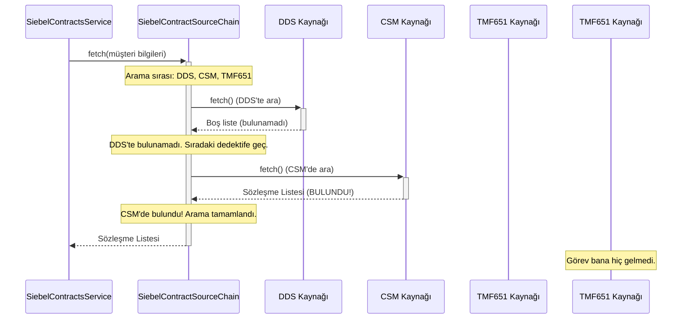

# Chapter 3: Siebel Veri Kaynağı Zinciri


Önceki bölümde, uygulamamızın [Legacy (CCB) Akışı](02_legacy__ccb__akışı_.md) ile eski sistemlerle nasıl bir "arkeolog" gibi çalışıp konuştuğunu öğrendik. Şimdi ise o tarihi sokaklardan ayrılıp modern dünyanın gökdelenlerine, yani `Siebel` akışına geçiş yapıyoruz. Bu modern dünyada işler biraz daha farklı ve çok daha dinamik.

[Önceki Bölüm: Legacy (CCB) Akışı](02_legacy__ccb__akışı_.md)

## Bir Dedektif Ekibine Neden İhtiyaç Duyarız?

Modern sistemlerde veri tek bir yerde durmayabilir. Bir müşterinin sözleşme bilgileri, performans için önbelleğe alınmış hızlı bir veritabanında (DDS gibi), yeni bir ana müşteri yönetim sisteminde (CSM gibi) veya daha eski bir SOAP servisinde olabilir. Peki, bir müşterinin sözleşmesini ararken doğru bilgiyi en hızlı ve güvenilir şekilde nasıl buluruz?

İşte bu noktada **Siebel Veri Kaynağı Zinciri** devreye giriyor. Bu mekanizmayı, bir müşterinin kayıp sözleşme dosyasını bulmakla görevlendirilmiş bir dedektif ekibi gibi düşünebilirsiniz. Ekibin şefi, dedektiflere belirli bir arama sırası verir: "Önce arşive (DDS) bak, bulamazsan muhasebeye (CSM) sor, o da olmazsa en son eski depoyu (Siebel SOAP) kontrol et."

*   İlk dedektif dosyayı bulduğu an, arama biter ve dosya anında merkeze getirilir.
*   Eğer bir dedektif dosyayı bulamazsa veya aradığı yerde bir sorunla karşılaşırsa, görev sessizce zincirdeki bir sonraki dedektife devredilir.

Bu yapı, sisteme inanılmaz bir **esneklik** ve **hata toleransı** kazandırır. Bir kaynak çalışmasa bile diğerleri görevi devralabilir.

## Zincirin Beyni: `SiebelContractSourceChain`

Bu dedektif ekibinin şefi `SiebelContractSourceChain` sınıfıdır. `SiebelContractsService`'ten gelen "bu müşterinin sözleşmelerini bul" emrini aldığında, görevi organize eden ve doğru dedektifi doğru zamanda sahaya süren odur.

Gelin bu şefin çalışma mantığına bakalım:

```java
// Dosya: src/main/java/com/vodafone/mcare/tariffoptions/service/contract/SiebelContractSourceChain.java

@Service
public class SiebelContractSourceChain {

    private final Map<SiebelContractSourceType, SiebelContractSource> sourceByType;
    private final ContractProperties contractProperties;
    // ... constructor ...

    public List<SiebelContract> fetch(ApiClientActor apiClientActor, ...) {
        // 1. Dedektiflerin arama sırasını belirle
        List<SiebelContractSourceType> order = resolveOrder();

        // 2. Sırayla her dedektifi göreve gönder
        for (SiebelContractSourceType type : order) {
            SiebelContractSource source = sourceByType.get(type); // Sıradaki dedektifi al
            
            // 3. Dedektiften aramayı yapmasını iste
            List<SiebelContract> contracts = source.fetch(apiClientActor, ...);

            // 4. Eğer dedektif bir şey bulduysa, görevi bitir ve sonucu dön
            if (!CollectionUtils.isEmpty(contracts)) {
                return contracts;
            }
        }
        // Eğer hiçbir dedektif bir şey bulamadıysa, boş bir sonuç dön
        return List.of();
    }
}
```
Bu kodun yaptığı iş tam olarak anlattığımız dedektif hikayesidir:
1.  **`resolveOrder()`**: Önce hangi sırayla arama yapılacağını belirler. Bu sıra, bir sonraki başlıkta göreceğimiz gibi dışarıdan yönetilir.
2.  **`for (SiebelContractSourceType type : order)`**: Belirlenen sırada her bir dedektifi (veri kaynağını) döngüye alır.
3.  **`source.fetch(...)`**: Sıradaki dedektife "ara" komutunu verir.
4.  **`if (!CollectionUtils.isEmpty(contracts))`**: Eğer dedektif boş olmayan bir sonuç listesi döndürürse (yani dosyayı bulursa), döngü anında kırılır ve bulunan sonuç geri döndürülür. Diğer dedektifler hiç göreve çağrılmaz.

## Arama Sırasını Kim Belirliyor? Yapılandırma Dosyası!

Peki dedektiflerin hangi sırayla arama yapacağına kim karar veriyor? Kodun kendisi mi? Hayır! İşte bu sistemin en güçlü yanlarından biri budur. Sıralama, projenin dışındaki `application.yml` yapılandırma dosyasından okunur.

```yaml
# Dosya: src/main/resources/application.yml

contract-properties:
  # ... diğer ayarlar ...
  siebel-source-order:
    - dds
    - csm
    - tmf651
    - siebel_soap
```

Bu yapılandırma, sisteme tam olarak şu emri verir: "Sözleşme ararken önce `dds`'e bak, sonra `csm`'e, sonra `tmf651`'e ve en son çare olarak `siebel_soap`'a sor."

Bu yaklaşımın güzelliği şudur: Eğer yarın `csm` sisteminin daha öncelikli olmasına karar verilirse, tek yapmamız gereken bu listedeki sırayı değiştirmektir. Koda dokunmamıza bile gerek kalmaz! Bu konuyu [Yapılandırma (Configuration) Odaklı Davranış](06_yapılandırma__configuration__odaklı_davranış_.md) bölümünde daha detaylı göreceğiz.

## Uzman Dedektifler: `SiebelContractSource` Ailesi

Zincirdeki her bir "dedektif", aslında `SiebelContractSource` arayüzünü (interface) uygulayan bir sınıftır. Bu arayüz, her dedektifin uyması gereken temel kuralları belirler.

```java
// Dosya: src/main/java/com/vodafone/mcare/tariffoptions/service/contract/siebel/source/SiebelContractSource.java

public interface SiebelContractSource {
    // Bu dedektif şu an aktif ve kullanılabilir durumda mı?
    boolean supports();

    // Bu dedektifin uzmanlık alanı (kimliği) nedir? (DDS, CSM vb.)
    SiebelContractSourceType getType();

    // Arama görevini yerine getiren asıl metot.
    List<SiebelContract> fetch(ApiClientActor apiClientActor, ...);
}
```

Her dedektif bu kontrata uymak zorundadır. Örneğin, DDS veritabanını sorgulayan dedektif şöyle görünür:

```java
// Dosya: src/main/java/com/vodafone/mcare/tariffoptions/service/contract/siebel/source/DdsSiebelContractSource.java

@Component // Bu sınıf bir dedektif olarak ekibe katılıyor
@RequiredArgsConstructor
public class DdsSiebelContractSource implements SiebelContractSource {

    private final DdsDao ddsDao; // DDS veritabanına erişim aracı
    // ...

    @Override
    public SiebelContractSourceType getType() {
        return SiebelContractSourceType.DDS; // Benim kimliğim DDS
    }

    @Override
    public List<SiebelContract> fetch(ApiClientActor apiClientActor, ...) {
        // Benim görevim DdsDao'yu kullanarak veritabanından sözleşmeleri bulmak
        return ddsDao.findActiveAgreements(apiClientActor.getLoggedInSubscriberMsisdn());
    }
}
```

Aynı şekilde, `CsmSiebelContractSource`, `Tmf651SiebelContractSource` ve `SiebelSoapContractSource` gibi diğer dedektifler de kendi uzmanlık alanlarına göre `fetch` metodunu doldururlar. Biri CSM servisine istek atarken, diğeri eski bir SOAP servisiyle konuşur. Ama zincirin beyni olan `SiebelContractSourceChain` için hepsi aynıdır; hepsi birer `SiebelContractSource`'tur.

## Zincirin Çalışma Anı: Bir Örnek

Sürecin tamamını daha iyi anlamak için bir şema üzerinde görelim. Diyelim ki yapılandırma dosyasındaki arama sırası `DDS -> CSM -> TMF651` şeklinde ve aradığımız veri CSM'de bulunuyor.



Gördüğünüz gibi, `Zincir` ilk olarak `DDS`'i denedi. Sonuç boş gelince, hiç vakit kaybetmeden sıradaki `CSM`'i denedi. `CSM` veriyi bulduğu için, `Zincir` aramayı anında sonlandırdı ve sonucu `Servis`'e geri döndü. `TMF651` dedektifine ise hiç ihtiyaç kalmadı.

## Özet ve Sonraki Adım

Bu bölümde, Siebel akışının karmaşık ama güçlü kalbini öğrendik:

*   **Siebel Veri Kaynağı Zinciri**, bir müşterinin sözleşme bilgilerini bulmak için birden çok veri kaynağını sırayla sorgulayan bir mekanizmadır.
*   Bu yapı, "Chain of Responsibility" (Sorumluluk Zinciri) tasarım desenini kullanır.
*   **`SiebelContractSourceChain`**, dedektif ekibinin şefi gibi davranarak arama sırasını yönetir.
*   Arama sırası, kodun içinde sabit değildir; `application.yml` dosyasından **dinamik olarak** yapılandırılabilir.
*   Zincirdeki her bir "dedektif" (`SiebelContractSource`), kendi uzmanlık alanında (DDS, CSM vb.) arama yapar.
*   Veriyi bulan ilk kaynak, aramayı sonlandırır. Bu, sisteme hem **hız**, hem **esneklik** hem de **hata toleransı** kazandırır.

Artık Legacy ve Siebel akışlarının her ikisinin de sözleşme verisini nasıl elde ettiğini biliyoruz. Peki bu veriyi elde ettikten sonra ne yapıyoruz? Genellikle bu ham veriyi zenginleştirmemiz gerekir. Örneğin, bir sözleşme için cayma bedeli (ceza) olup olmadığını nasıl öğreniriz?

Bir sonraki bölümde, bu zenginleştirme adımlarından ilkini inceleyeceğiz.

[Sonraki Bölüm: Cayma Bedeli (Ceza) Entegrasyonu](04_cayma_bedeli__ceza__entegrasyonu_.md)

---

Generated by [AI Codebase Knowledge Builder](https://github.com/The-Pocket/Tutorial-Codebase-Knowledge)