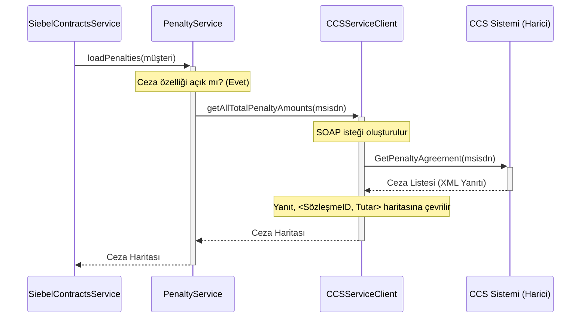

# Chapter 4: Cayma Bedeli (Ceza) Entegrasyonu


Önceki bölümde, modern [Siebel Veri Kaynağı Zinciri](03_siebel_veri_kaynağı_zinciri_.md) yapısının bir dedektif ekibi gibi çalışarak farklı kaynaklardan sözleşme bilgilerini nasıl topladığını öğrendik. Ekibimiz ana görevi tamamladı ve sözleşmelerin temel bilgilerini buldu. Ancak hikaye burada bitmiyor. Bazen, ana delil dosyasının yanında, onunla ilişkili ama tamamen farklı bir departmanda tutulan ek bir rapor olabilir. İşte bu rapor, bizim için "cayma bedeli" veya "ceza" bilgisidir.

[Önceki Bölüm: Siebel Veri Kaynağı Zinciri](03_siebel_veri_kaynağı_zinciri_.md)

## Neden Ayrı Bir Uzmana İhtiyacımız Var?

Hayal edin ki bir ev satın alıyorsunuz. Tapu dairesinden evin tüm bilgilerini (oda sayısı, metrekaresi vb.) aldınız. Bu, bizim `Siebel` akışımızın yaptığı işe benzer. Ama bu evin geçmişten gelen bir vergi borcu olup olmadığını tapu dairesi bilmez. Bu bilgi için belediyenin vergi dairesine, yani tamamen farklı bir birime gitmeniz gerekir.

Bizim sistemimizde de durum aynıdır. Sözleşme bilgileri `Siebel` veya `DDS` gibi sistemlerde tutulurken, bir müşteri sözleşmesini erken sonlandırırsa ödemesi gereken ceza tutarı (cayma bedeli) **CCS (Commitment Control System)** adında tamamen ayrı bir sistemde hesaplanır ve saklanır.

Bu bölümün amacı, ana sözleşme bulma akışımızın, bu "vergi dairesine" nasıl gidip ilgili ceza bilgilerini aldığını ve bu bilgileri ana sözleşme verisiyle nasıl birleştirdiğini anlamaktır. Bu yaklaşım, sorumlulukları net bir şekilde ayırır: Sözleşme bulma işi ayrı, ceza hesaplama işi ayrı bir uzmanlık alanıdır.

## Ceza Sorgulama Operasyonu

Siebel akışı, sözleşme listesini başarıyla elde ettikten sonra, bu listeyi zenginleştirmek için bir mola verir. "Elimde bu sözleşmeler var, şimdi gidip bunların ceza kayıtları var mı bir bakayım" der. Bu görevi, ceza sorgulama konusunda uzmanlaşmış servislere devreder.

Bu operasyon iki ana oyuncudan oluşur:

1.  **`PenaltyService` (Orkestratör):** Ana akışın konuştuğu ilk noktadır. Görevi basittir: Ceza sorgulama özelliği yapılandırmada açık mı? Açıksa, görevi asıl uzmana devret.
2.  **`CCSServiceClient` (Uzman İletişimci):** Dış dünyadaki CCS sistemiyle SOAP dilinde konuşan gerçek uzmandır. İsteği oluşturur, CCS'e gönderir ve gelen yanıtı ana sistemin anlayacağı bir dile çevirir.

### Adım 1: Orkestratörün Devreye Girmesi (`SiebelContractsService`)

Her şey, `SiebelContractsService`'in ceza bilgilerine ihtiyaç duymasıyla başlar. Sözleşmeleri bulduktan sonra, yanıtı oluşturmadan hemen önce `PenaltyService`'i göreve çağırır.

```java
// Dosya: src/main/java/com/vodafone/mcare/tariffoptions/service/contract/SiebelContractsService.java

// ...

private ContractListResponse buildContractResponse(ApiClientActor apiClientActor, SiebelCallContext siebelCallContext, List<SiebelContract> orderedContracts) {
    ContractList.Builder contractList = ContractList.newBuilder();
    
    // 1. Orkestratörden tüm cezaları yüklemesini istiyoruz.
    Map<String, String> penaltiesMap = penaltyService.loadPenalties(apiClientActor, siebelCallContext);
    
    // 2. Her sözleşme için...
    for (SiebelContract contract : orderedContracts) {
        // ... ceza haritasını kullanarak yanıtı oluştur.
        Contract.Builder builder = contractAssembler.prepareContractForSiebel(
                contract,
                penaltiesMap, // Haritayı çevirmene ver
                ...);
        contractList.addContract(builder.build());
    }
    return ...;
}
```

Bu kodda en önemli kısım `penaltyService.loadPenalties` çağrısıdır. Bu çağrı sonucunda `penaltiesMap` adında bir "ceza haritası" elde ederiz. Bu harita, bir sözleşme ID'sini anahtar olarak, ceza tutarını ise değer olarak tutar (`Sözleşme ID -> Ceza Tutarı`). Bu yapı, daha sonra her sözleşmenin cezasını anında bulmamızı sağlar.

### Adım 2: `PenaltyService`'in Kontrolü

`PenaltyService`'in görevi çok nettir. Önce sistem yöneticisinin bu özelliği açıp açmadığını kontrol eder.

```java
// Dosya: src/main/java/com/vodafone/mcare/tariffoptions/service/contract/PenaltyService.java

@Service
@RequiredArgsConstructor
public class PenaltyService {

    private final CCSServiceClient ccsServiceClient;
    private final ContractProperties contractProperties;

    public Map<String, String> loadPenalties(ApiClientActor apiClientActor, ...) {
        // Yapılandırmada ceza özelliği kapalı mı?
        if (!contractProperties.isPenaltyEnable()) {
            // Öyleyse, hiç uğraşma ve boş bir harita dön.
            return Collections.emptyMap();
        }
        
        // Özellik açıksa, görevi uzman iletişimciye devret.
        Map<String, String> penalties = ccsServiceClient.getAllTotalPenaltyAmounts(...);
        
        // ...
        return penalties;
    }
}
```

Bu basit kontrol, [Yapılandırma Odaklı Davranış](06_yapılandırma__configuration__odaklı_davranış_.md) prensibinin güzel bir örneğidir. CCS sisteminde bir sorun olduğunda, kodu değiştirmeden sadece bir ayarı kapatarak tüm ceza sorgulama akışını devre dışı bırakabiliriz.

### Adım 3: Uzmanın CCS Sistemiyle Konuşması (`CCSServiceClient`)

Şimdi geldik işin en teknik kısmına. `CCSServiceClient`, müşterinin telefon numarasını alarak dış sistem olan CCS'e bir SOAP isteği gönderir.

```java
// Dosya: src/main/java/com/vodafone/mcare/tariffoptions/extcall/soap/ccs/CCSServiceClientImpl.java

@Override
@VfCacheable(keyExpression = "{#p0}") // Bu MSISDN için sonucu önbelleğe al
@CircuitBreaker(name = HX_CIRCUIT_NAME) // Hata olursa devreyi kes
public Map<String, String> getAllTotalPenaltyAmounts(String msisdn, ...) {
    // CCS sisteminin anlayacağı dilde bir istek oluştur.
    GetPenaltyAgreement_v1 request = buildGetPenaltyAgreementRequestForAll(msisdn);
    
    // İsteği gönder ve yanıtı al.
    GetPenaltyAgreementResponse response = sendAndReceive(request, ...);
    
    // Yanıt boş değilse, onu kullanışlı bir haritaya çevir.
    if (response.getResponse() != null && ...) {
        return getStringStringMap(response);
    }
    
    return Collections.emptyMap();
}
```

Bu kodda iki önemli detay var:
*   `@VfCacheable`: Bu "sihirli" notasyon, bu metodun sonucunu kısa bir süreliğine hafızaya alır. Eğer aynı müşteri için saniyeler içinde tekrar ceza sorgulaması gerekirse, CCS sistemine tekrar gitmek yerine hafızadaki sonucu kullanarak hem hız kazanır hem de dış sistemin yükünü azaltır.
*   `getStringStringMap`: CCS'ten gelen yanıt, bir liste şeklindedir. Bu metot, bu listeyi bizim için çok daha kullanışlı olan `Sözleşme ID -> Ceza Tutarı` haritasına dönüştürür.

### Adım 4: Haritanın Oluşturulması

Peki bu sihirli harita nasıl oluşturuluyor? `CCSServiceClient`'ın içindeki yardımcı bir metot, CCS'ten gelen her bir ceza kaydını döngüye alarak bu haritayı inşa eder.

```java
// Dosya: src/main/java/com/vodafone/mcare/tariffoptions/extcall/soap/ccs/CCSServiceClientImpl.java

private Map<String, String> getStringStringMap(GetPenaltyAgreementResponse getPenaltyAgreementResponse) {
    List<Agreement> agreements = ...;
    Map<String, String> penaltyMap = new HashMap<>();

    for (Agreement agreement : agreements) {
        // Bu sözleşmenin toplam cezasını hesapla
        String totalPenaltyAmount = calculateTotalPenaltyAmount(agreement);
        
        // Haritaya ekle: Anahtar = Sözleşme ID, Değer = Hesaplanan Ceza
        penaltyMap.put(agreement.getAgreementId(), totalPenaltyAmount);
    }
    return penaltyMap;
}
```
Bu metot, dağınık haldeki ceza bilgilerini düzenli bir "fihrist" haline getirir. Ana akış, artık bu fihristi kullanarak istediği sözleşmenin cezasını anında bulabilir.

## Akışın Tamamı

Bu adımları birleştirdiğimizde ortaya çıkan iletişim şeması şöyledir:



Akış tamamlandığında, `SiebelContractsService`'in elinde iki değerli bilgi vardır:
1.  `Siebel`'den gelen sözleşmelerin listesi.
2.  `CCS`'ten gelen ve bu sözleşmelere ait olabilecek cezaların haritası.

## Özet ve Sonraki Adım

Bu bölümde, ana iş akışının, kendisiyle doğrudan ilgili olmayan bir bilgiyi nasıl "delege ederek" elde ettiğini gördük:

*   **Sorumlulukların Ayrılması:** Sözleşme bulma mantığı ile ceza sorgulama mantığı birbirinden tamamen ayrılmıştır.
*   **Uzman Servisler:** `PenaltyService` ve `CCSServiceClient` gibi uzmanlaşmış servisler, ceza sorgulama işinin tüm karmaşıklığını kendi içlerinde saklar.
*   **Verimli Veri Aktarımı:** Ceza bilgileri, ana akışa bir `Map` (harita) olarak sunulur. Bu, verinin sonraki adımlarda çok hızlı bir şekilde kullanılmasını sağlar.
*   **Dayanıklılık:** Yapılandırma (`isPenaltyEnable`) ve önbellekleme (`@VfCacheable`) gibi mekanizmalar sayesinde sistem daha esnek ve dayanıklıdır.

Artık elimizde hem sözleşmelerin ana verisi hem de onlara ait ek ceza bilgileri var. Peki bu farklı kaynaklardan toplanan ham verileri, son kullanıcının mobil uygulamasında göreceği anlamlı ve düzenli bir yanıta nasıl dönüştüreceğiz?

Bir sonraki bölümde, bu birleştirme ve dönüştürme sanatını, yani `Assembler`'ların rolünü inceleyeceğiz.

[Sonraki Bölüm: Yanıt (Response) Oluşturma ve Zenginleştirme](05_yanıt__response__oluşturma_ve_zenginleştirme_.md)

---

Generated by [AI Codebase Knowledge Builder](https://github.com/The-Pocket/Tutorial-Codebase-Knowledge)