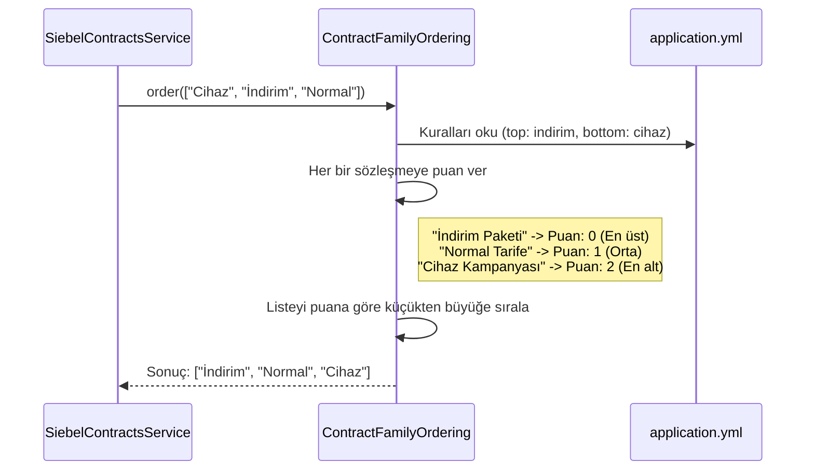

# Chapter 4: Sözleşme Ailesi Sıralama ve Normalleştirme


Önceki bölümlerde, [Sözleşme Veri Kaynağı Zinciri (Siebel Akışı)](02_sözleşme_veri_kaynağı_zinciri__siebel_akışı__.md) ve [Eski Sistem Sözleşme Akışı (Legacy/CCB)](03_eski_sistem_sözleşme_akışı__legacy_ccb__.md) sayesinde farklı kaynaklardan müşterinin sözleşme listesini nasıl topladığımızı öğrendik. Ancak bu verileri toplamak, hikayenin sadece yarısıdır. Gelen bu sözleşmeler genellikle sistemden çıktığı sırayla, yani tamamen rastgele bir düzende elimize ulaşır.

Peki, bu dağınık listeyi müşteriye göstermeden önce nasıl anlamlı ve düzenli bir hale getiririz? "İndirim" içeren bir kampanyayı neden listenin en üstünde, "cihaz" içeren bir sözleşmeyi ise neden en altta göstermek isteyelim? İşte bu bölümde, projemizin "kütüphane görevlisi" olarak çalışan akıllı sıralama mekanizmasını tanıyacağız.

### Problem: Dağınık Kitaplar ve Sabırsız Müşteriler

Bir kütüphaneye girdiğinizi ve tüm kitapların raflara rastgele atıldığını hayal edin. Aradığınız kitabı bulmak neredeyse imkansız olurdu, değil mi? Sistemimizden gelen sözleşme listesi de ilk başta aynen böyledir: dağınık bir kitap yığını.

Örneğin, sistem bize bir müşteri için şu üç sözleşmeyi bu sırayla verebilir:
1.  `iPhone 15 Cihaz Kampanyası`
2.  `Hoş Geldin İndirimi`
3.  `Red 20GB Paketi`

Bu listeyi olduğu gibi kullanıcıya göstermek kafa karıştırıcı olabilir. Kullanıcı için en önemli olan şey genellikle indirimler veya ana paketidir. Cihaz bilgisi ise genellikle daha az önceliklidir. İdeal olarak, bu listeyi kullanıcıya şu şekilde sunmak isteriz:
1.  `Hoş Geldin İndirimi` (İndirimler en dikkat çekici olmalı)
2.  `Red 20GB Paketi` (Ana tarife)
3.  `iPhone 15 Cihaz Kampanyası` (Ek cihaz bilgileri en sonda)

İşte bu bölümde, bu "raf düzenleme" işleminin nasıl yapıldığını adım adım inceleyeceğiz.

### Çözümün Kalbi: `ContractFamilyOrdering`

Projemizdeki bu akıllı kütüphane görevlisinin adı `ContractFamilyOrdering`. Bu, kendisine verilen herhangi bir sözleşme listesini, önceden belirlenmiş kurallara göre sıralayan özel bir yardımcı sınıftır.

Bu görevlinin işini iki temel adımda yaptığını düşünebiliriz:
1.  **Normalleştirme (Etiketleri Temizleme):** Kitapların adlarındaki "promosyon", "kampanya" gibi ek yazıları temizleyerek kitabın ana ismini bulur. Bu, karşılaştırmayı kolaylaştırır.
2.  **Sıralama (Raflara Dizme):** Temizlenmiş isimlere bakarak, hangi kitabın "en önemli" (en üste), hangisinin "en önemsiz" (en alta) ve hangilerinin "standart" (ortada) olduğuna karar verir ve listeyi buna göre yeniden düzenler.

Gelin bu iki adımı ve bu kuralların nereden geldiğini daha yakından görelim.

### Adım 1: Normalleştirme - Gürültüyü Azaltmak

Sıralama yapmadan önce, sözleşme isimlerini adil bir şekilde karşılaştırabilmemiz gerekir. Örneğin, sistemdeki iki farklı sözleşmenin adı şöyle olabilir:
*   `Red 20GB Kampanya`
*   `Red 20GB Promosyon`

Aslında bu iki sözleşme de aynı "Red 20GB" ailesine aittir. Ama isimlerinin sonundaki "Kampanya" ve "Promosyon" ekleri yüzünden bilgisayar bunları farklı şeyler olarak algılayabilir.

**Normalleştirme**, işte bu "gürültüyü" temizleme işlemidir. Sözleşme isimlerinin sonundaki önemsiz ekleri atarak sadece ana kimliğin kalmasını sağlar.

Bu temizlenecek kelimeler listesi, kodun içinde sabit değildir. Esnek bir şekilde `application.yml` dosyasından yönetilir:

```yaml
# Dosya: src/main/resources/application.yml

contract-properties:
  # ...
  contract-family-ordering:
    normalize:
      strip-suffixes:
        - promotion # "promotion" kelimesini ve Türkçesini temizle
    # ...
```
*(Not: Gerçek `yml` dosyasında "kampanya" gibi Türkçe kelimeler de olabilir. Burada örnek olarak İngilizcesi gösterilmiştir.)*

Bu kural sayesinde, `ContractFamilyOrdering` sınıfı bir ismin sonundaki "promotion" kelimesini otomatik olarak siler. Böylece her iki sözleşme de karşılaştırma için "red 20gb" olarak sadeleşir.

### Adım 2: Sıralama - Herkes Yerine!

Sözleşme isimleri temizlendikten sonra, asıl sıralama işlemi başlar. Kurallarımız yine çok basit ve `application.yml` dosyasında tanımlanmıştır:

```yaml
# Dosya: src/main/resources/application.yml

contract-properties:
  # ...
  contract-family-ordering:
    # ...
    top: # Bu kelimeleri içerenler EN ÜSTE gelsin
      - discount
    bottom: # Bu kelimeleri içerenler EN ALTA gitsin
      - accessory
      - handset
```

Bu yapılandırma, kütüphane görevlimize şu talimatları verir:
*   **`top` (Öncelikli Raf):** Eğer bir sözleşmenin normalleştirilmiş adında "discount" (indirim) kelimesi geçiyorsa, onu listenin en başına koy.
*   **`bottom` (Arka Raf):** Eğer adında "accessory" (aksesuar) veya "handset" (cihaz) kelimeleri geçiyorsa, onu listenin en sonuna at.
*   Diğer tüm sözleşmeler bu ikisinin arasında, kendi orijinal sıralarında kalır.

### Uygulamada Nasıl Çalışıyor? `SiebelContractsService`

Teoriyi anladığımıza göre, şimdi bu sihrin kodun neresinde gerçekleştiğine bakalım. Veri kaynakları zincirinden sözleşme listesini alan `SiebelContractsService`, bu listeyi doğrudan kullanıcıya göndermez. Önce sıralama için kütüphane görevlimize, yani `ContractFamilyOrdering`'e teslim eder.

```java
// Dosya: src/main/java/com/vodafone/mcare/tariffoptions/service/contract/SiebelContractsService.java

public class SiebelContractsService {
    // ...

    public ContractListResponse handle(ApiClientActor apiClientActor, String isDetailed) {
        // 1. Veri kaynaklarından dağınık sözleşme listesini al
        List<SiebelContract> siebelContracts = siebelContractSourceChain.fetch(...);
        
        // 2. Kütüphane görevlisine teslim et ve sıralanmış halini geri al
        List<SiebelContract> orderedContracts = orderContracts(siebelContracts);

        // ... sıralanmış liste ile yanıtı oluştur
        return buildContractResponse(..., orderedContracts);
    }

    private List<SiebelContract> orderContracts(List<SiebelContract> siebelContracts) {
        // İşte sihrin gerçekleştiği yer!
        return ContractFamilyOrdering.order(
                siebelContracts, // Sıralanacak liste
                SiebelContract::getContractFamily, // Hangi alana göre sıralanacak? (sözleşme ailesi adı)
                contractProperties.getContractFamilyOrdering().getTop(), // Üste gelecekler listesi (yml'den)
                contractProperties.getContractFamilyOrdering().getBottom(), // Alta gidecekler listesi (yml'den)
                // ... diğer yapılandırma ayarları
        );
    }
}
```
Gördüğünüz gibi, `SiebelContractsService`'in görevi çok nettir: dağınık listeyi al, `ContractFamilyOrdering.order` metoduna ver ve sıralanmış sonucu geri al. Tüm karmaşık mantık, `ContractFamilyOrdering` sınıfının içinde gizlidir.

### Perde Arkası: `ContractFamilyOrdering`'in Çalışma Mantığı

Bu sınıfın nasıl çalıştığını basit bir akış şemasıyla görelim. Elimizde şu liste olsun: `["Cihaz Kampanyası", "İndirim Paketi", "Normal Tarife"]`.



Peki bu puanlama nasıl yapılıyor? `ContractFamilyOrdering` sınıfının içindeki mantık aslında çok basittir:

```java
// Dosya: src/main/java/com/vodafone/mcare/tariffoptions/domain/contract/ContractFamilyOrdering.java

public final class ContractFamilyOrdering {
    // ...

    public static <T> List<T> order(...) {
        // ...
        List<T> ordered = new ArrayList<>(items);
        ordered.sort(Comparator.comparingInt(each -> {
            // 1. Sözleşme adını normalleştir (temizle)
            String normalizedFamily = normalizeIncomingWithPatterns(...);
            
            // 2. Puan ver
            if (matches(normalizedFamily, ..., topKeywords, ...)) {
                return 0; // Eğer 'top' listesindeyse, en düşük puan (en başa gelir)
            }
            if (matches(normalizedFamily, ..., bottomKeywords, ...)) {
                return 2; // Eğer 'bottom' listesindeyse, en yüksek puan (en sona gider)
            }
            return 1; // Diğer her şey ortada kalır
        }));
        return ordered;
    }
    // ...
}
```
Kod, her sözleşme için basit bir puanlama yapar:
*   Öncelikli ise **0 puan**
*   Sondan başlanacaksa **2 puan**
*   Standart ise **1 puan**

Daha sonra Java'nın standart sıralama fonksiyonunu kullanarak listeyi bu puanlara göre küçükten büyüğe dizer. Sonuç olarak elimizde mükemmel şekilde düzenlenmiş bir liste olur.

### Özet

Bu bölümde, sistemden gelen dağınık sözleşme listelerini müşteriye sunmadan önce nasıl akıllıca düzenlediğimizi öğrendik.

*   **Amaç Kullanıcı Deneyimidir:** Sözleşmeleri rastgele değil, mantıklı bir öncelik sırasına göre göstermek, kullanıcının aradığını daha kolay bulmasını sağlar.
*   **Normalleştirme Şarttır:** "Kampanya", "Promosyon" gibi ekleri temizleyerek sözleşme ailelerini daha tutarlı bir şekilde karşılaştırırız.
*   **`ContractFamilyOrdering` Sorumludur:** Bu sınıf, sıralama işleminin tüm mantığını kendi içinde barındıran "kütüphane görevlimizdir".
*   **Kurallar `application.yml`'de Yaşar:** Hangi sözleşmelerin üste, hangilerinin alta gideceği kodun içinde değil, bir yapılandırma dosyasındadır. Bu, iş kurallarını kod değişikliği yapmadan güncelleyebilmemizi sağlar.
*   **Süreç Basittir:** Önce temizle (normalize et), sonra puanla ve sırala.

Artık hem farklı kaynaklardan sözleşmeleri nasıl getirdiğimizi hem de onları nasıl düzenlediğimizi biliyoruz. Peki, bu düzenlenmiş veriler son kullanıcıya gösterilecek JSON formatına nasıl dönüştürülüyor? Bu "veri dönüştürme" işlemini bir sonraki bölümde ele alacağız.

**Sıradaki Bölüm:** [Yanıt Oluşturucular (Assemblers)](05_yanit_olusturucular_assemblers_.md)

---

Generated by [AI Codebase Knowledge Builder](https://github.com/The-Pocket/Tutorial-Codebase-Knowledge)
