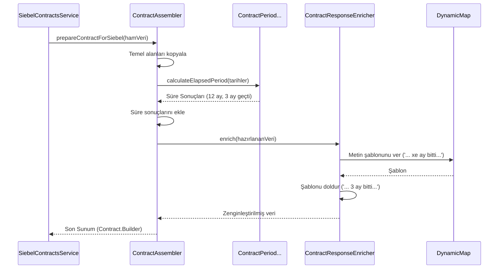

# Chapter 5: Yanıt Oluşturucular (Assemblers)


Önceki bölüm olan [Sözleşme Ailesi Sıralama ve Normalleştirme](04_sözleşme_ailesi_sıralama_ve_normalleştirme_.md) konusunda, farklı kaynaklardan topladığımız dağınık sözleşme listesini nasıl mantıklı bir sıraya koyduğumuzu öğrendik. Artık elimizde düzenli bir liste var. Ancak bu liste hala teknik detaylar içeren, ham bir veri yığını. Tarihler "2024-12-25T10:00:00Z" gibi teknik bir formatta, sözleşme süresi gibi bilgiler ise sadece başlangıç ve bitiş tarihinden ibaret.

Bu ham veriyi doğrudan müşterinin telefon ekranına gönderebilir miyiz? Elbette hayır! İşte bu bölümde, projemizin "sunum tasarımcıları" olan **Assembler**'ları tanıyacağız. Görevleri, bu ham ve teknik veriyi alıp, son kullanıcının anlayacağı, şık ve anlamlı bir sunuma dönüştürmektir.

### Problem: Teknik Dili Müşteri Diline Çevirmek

Arka uç sistemlerden gelen bir sözleşme verisinin (`SiebelContract`) şuna benzediğini düşünelim:

```java
// Ham ve teknik sözleşme verisi
SiebelContract {
    productName: "RED25GB KMPNY",
    contractId: "1-ABCDE",
    startDate: 2023-09-01,
    endDate: 2024-09-01,
    // ... diğer teknik alanlar
}
```

Bu veri bir yazılımcı için anlamlı olabilir, ancak bir müşteri için hiçbir şey ifade etmez. Müşterinin görmek istediği şey şuna benzer:

```json
// Müşterinin görmek istediği son format (JSON)
{
  "name": "Red 25 GB Kampanyası. 12 ayın 3'ü tamamlandı, 9 ay kaldı.",
  "contractStartDate": "01.09.2023",
  "contractEndDate": "01.09.2024",
  "installmentDesc": "Sözleşmeniz 01 Eylül 2024, Cuma günü sona erecektir. Toplam 12 aylık sürenin 3 ayı tamamlanmıştır.",
  "totalPenaltyAmount": "150,00 TL"
}
```

Peki, bu iki dünya arasında köprüyü kim kuruyor? Teknik veriyi alıp nasıl bu kadar zengin ve anlaşılır bir hale getiriyoruz? İşte bu dönüşümün sihirbazları **Assembler**'lardır.

### Ana Tasarımcı: `ContractAssembler`

Bu dönüşüm sürecinin merkezinde `ContractAssembler` sınıfı yer alır. Bu sınıfı, eline ham malzemeleri (veri nesnelerini) alan bir aşçı gibi düşünebilirsiniz. Aşçı, bu malzemeleri doğrar, pişirir, baharatlar ekler ve sonunda göze hoş gelen, lezzetli bir tabak hazırlar. `ContractAssembler` da tam olarak bunu yapar.

Temel görevleri şunlardır:
1.  **Veri Aktarımı:** Ham veri nesnesindeki temel bilgileri (`id`, `name` vb.) yeni sonuç nesnesine aktarır.
2.  **Hesaplama:** Başlangıç ve bitiş tarihlerini kullanarak sözleşmenin toplam süresini ve ne kadarının geçtiğini hesaplar.
3.  **Formatlama:** Teknik tarih formatlarını (`2024-09-01`) kullanıcı dostu formatlara (`01.09.2024`) çevirir.
4.  **Zenginleştirme:** Diğer yardımcıları kullanarak dinamik ve açıklayıcı metinler oluşturur.

Gelin `ContractAssembler`'ın en önemli metoduna bakalım:

```java
// Dosya: src/main/java/com/vodafone/mcare/tariffoptions/assembler/contract/ContractAssembler.java

@Component
public class ContractAssembler {
    // ... yardımcı sınıflar enjekte edilir

    public Contract.Builder prepareContractForSiebel(SiebelContract contract, ...) {
        // 1. Boş bir sonuç nesnesi (tabak) oluştur
        Contract.Builder builder = Contract.newBuilder();
        
        // 2. Temel alanları doğrudan aktar
        setBasicFields(contract, builder);

        // 3. Süre hesaplamalarını yap ve ekle
        setContractPeriodAndElapsedPeriod(contract, builder);

        // 4. Cayma bedeli bilgisini ekle
        setPenalty(builder, contract, ...);

        // 5. En son "sihirli dokunuşu" yap: dinamik metinleri oluştur
        contractResponseEnricher.enrich(builder, languageId);
        
        return builder;
    }
    // ...
}
```
Bu metot, dönüşüm sürecinin adımlarını çok net bir şekilde özetler. Her bir yardımcı metot, büyük bir görevin küçük bir parçasını üstlenir.

#### Adım 1 & 2: Temel Veri ve Süre Hesaplama

`setBasicFields` metodu, `productName` gibi alanları doğrudan hedef nesneye kopyalar. `setContractPeriodAndElapsedPeriod` ise daha ilginç bir iş yapar:

```java
// Dosya: src/main/java/com/vodafone/mcare/tariffoptions/assembler/contract/ContractAssembler.java

private void setContractPeriodAndElapsedPeriod(SiebelContract contract, Contract.Builder builder) {
    // ... tarih kontrolleri ...
    LocalDate baslangicTarihi = // contract.getStartDate()'den çevrilir
    LocalDate bitisTarihi = // contract.getEndDate()'den çevrilir
    LocalDate bugun = // şu anki tarih alınır

    // Matematiksel hesaplamayı yapması için uzman sınıfı çağır
    ContractPeriodAndRemainingPeriod sureHesabi = 
        ContractPeriodAndRemainingPeriod.calculateElapsedPeriod(bitisTarihi, baslangicTarihi, bugun);

    // Sonuçları hedef nesneye ekle
    builder.setTotalContractPeriod(String.valueOf(sureHesabi.getContractPeriod())); // örn: "12"
    builder.setElapsedPeriod(String.valueOf(sureHesabi.elapsedPeriod()));       // örn: "3"
}
```
Bu kod, tarihleri alıp karmaşık hesaplamayı `ContractPeriodAndRemainingPeriod` adında başka bir uzmana devrederek işleri basitleştirir. Sonuç olarak elimizde "toplam 12 ay" ve "geçen 3 ay" gibi net rakamlar olur.

#### Adım 3: Metin Sihirbazı - `ContractResponseEnricher`

Sayıları elde ettik. Peki, `"12 ayın 3'ü tamamlandı, 9 ay kaldı."` gibi akıcı bir metni nasıl oluşturuyoruz? İşte bu noktada `ContractAssembler`'ın en önemli yardımcısı olan `ContractResponseEnricher` devreye girer. Bu sınıfın tek görevi, eldeki sayısal verileri kullanarak dinamik metin şablonlarını doldurmaktır.

```java
// Dosya: src/main/java/com/vodafone/mcare/tariffoptions/assembler/contract/support/ContractResponseEnricher.java

@Component
public class ContractResponseEnricher {

    private final DynamicMap dynamicMap; // Metin şablonlarını tutan veritabanı

    public void enrich(Contract.Builder contract, String languageId) {
        // ... sayısal verileri al (geçen ay, kalan ay vb.) ...
        
        // Uzmanlığı kullanarak açıklayıcı metinler oluştur
        String friendlyDesc = buildFriendlyDesc(contract, languageId, ...);
        
        // Oluşturulan metni, mevcut ismin sonuna ekle
        contract.setFriendlyName(contract.getFriendlyName() + friendlyDesc);
        // ... diğer metinleri de oluştur ve ekle ...
    }
    
    private String buildFriendlyDesc(Contract.Builder contract, ..., int elapsedMonth, int remainingMonth) {
        if (remainingMonth > 0) {
            // 1. Veritabanından metin şablonunu al: ". xe ay bitti, xr ay kaldı."
            String template = dynamicMap.getValue(languageId, "AGREEMENT_FRIENDLYDESCTMP", ...).getMessageTemplate();
            
            // 2. Boşlukları doldur
            return ". " + template.replace("xe", String.valueOf(elapsedMonth))
                                 .replace("xr", String.valueOf(remainingMonth));
        }
        // ... diğer durumlar ...
        return "";
    }
}
```
Bu sınıfın güzelliği, metinlerin kodun içinde sabit olmamasıdır. `dynamicMap`, metinleri bir veritabanından veya yapılandırma dosyasından çeker. Bu sayede, yarın bir metni değiştirmek istediğimizde (örneğin "bitti" yerine "tamamlandı" yazmak istediğimizde) kodu değiştirmemize gerek kalmaz!

### İki Farklı Sunum: `COMPACT` ve `DETAILED`

Assembler'lar sadece tek bir tür sunum hazırlamakla kalmaz. Bazen bir ekran sadece kısa bir özet (`COMPACT`) göstermek isterken, başka bir ekran tüm detayları (`DETAILED`) görmek isteyebilir. Projemizdeki Assembler'lar bu ihtiyaca cevap verir.

*   **`ContractAssembler` (COMPACT):** Genellikle sözleşme listeleri gibi özet bilgilerin gerektiği yerlerde kullanılır. `Contract` nesnesi üretir.
*   **`CampaignAssembler` (DETAILED):** Bir sözleşmenin üzerine tıklandığında açılan detay ekranı için daha zengin ve ayrıntılı bir sunum hazırlar. `CampaignRto` nesnesi üretir.

Bu yapı, farklı ekranların ihtiyaçlarına göre farklı detay seviyelerinde yanıtlar oluşturmamızı sağlar.

### Sürecin Görsel Akışı

Assembler'ların bu "sunum hazırlama" sürecini bir diyagramla özetleyelim:


Bu diyagram, `Assembler`'ın orkestra şefi gibi davranarak farklı uzmanları (hesaplayıcı, zenginleştirici) nasıl yönettiğini ve ham veriden son kullanıcıya gösterilecek cilalanmış bir sunumu nasıl adım adım oluşturduğunu gösterir.

### Özet

Bu bölümde, projemizin "sunum katmanı" olan Assembler'ların kritik rolünü öğrendik.

*   **Assembler'lar birer dönüştürücüdür:** Arka uç sistemlerden gelen ham ve teknik veri nesnelerini alıp, kullanıcı arayüzünün ihtiyaç duyduğu şık ve anlaşılır nesnelere dönüştürürler.
*   **Sadece veri kopyalamazlar:** Süre hesaplama, tarih formatlama ve metin oluşturma gibi önemli ek görevleri de yerine getirirler.
*   **İş bölümü yaparlar:** `ContractAssembler` gibi ana sınıflar, `ContractPeriodAndRemainingPeriod` (hesaplama uzmanı) ve `ContractResponseEnricher` (metin sihirbazı) gibi daha küçük ve odaklanmış yardımcılarla çalışır.
*   **Dinamik ve esnektirler:** Kullanıcıya gösterilen metinler kodun içinde sabit değildir, `DynamicMap` üzerinden yönetilir. Bu, metinleri kod değişikliği yapmadan güncellemeyi kolaylaştırır.
*   **Farklı sunumlar hazırlayabilirler:** İsteğe bağlı olarak özet (`COMPACT`) veya detaylı (`DETAILED`) yanıtlar üretebilirler.

Artık veriyi nasıl topladığımızı, nasıl sıraladığımızı ve son olarak nasıl kullanıcıya sunulacak hale getirdiğimizi biliyoruz. Assembler'ların eklediği önemli bilgilerden biri de "cayma bedeli" idi. Peki bu hassas bilgi nasıl hesaplanıyor? Bir sonraki bölümde, bu hesaplama için başka bir harici sistemle (CCS) nasıl entegre olduğumuzu inceleyeceğiz.

**Sıradaki Bölüm:** [Cayma Bedeli Hesaplama (CCS Entegrasyonu)](06_cayma_bedeli_hesaplama__ccs_entegrasyonu__.md)

---

Generated by [AI Codebase Knowledge Builder](https://github.com/The-Pocket/Tutorial-Codebase-Knowledge)