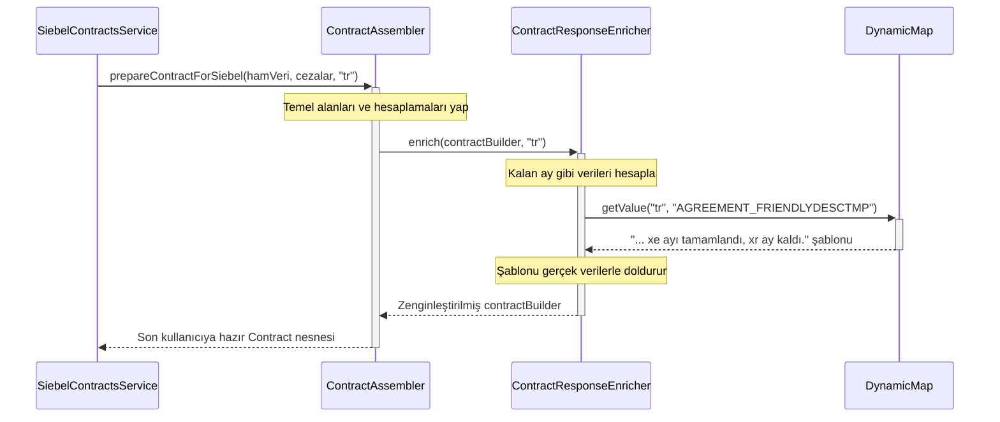

# Chapter 5: Yanıt (Response) Oluşturma ve Zenginleştirme


Önceki bölümde, ana sözleşme bilgilerini bulduktan sonra [Cayma Bedeli (Ceza) Entegrasyonu](04_cayma_bedeli__ceza__entegrasyonu_.md) ile tamamen farklı bir sistemden ek ceza bilgilerini nasıl aldığımızı gördük. Artık elimizde `Siebel`'den gelen ham sözleşme verileri ve `CCS`'ten gelen ceza tutarları gibi birbirinden ayrı parçalar var. Peki bu dağınık ve teknik bilgileri, bir kullanıcının mobil uygulamasında göreceği anlamlı ve şık bir sunuma nasıl dönüştüreceğiz?

İşte bu bölümde, projemizin "usta aşçıları" ve "yemek stilistleri" ile tanışacağız. Bu bileşenler, topladığımız tüm ham malzemeleri alıp son kullanıcı için lezzetli ve anlaşılır bir "yemek" haline getirirler.

## Bir Usta Aşçıya Neden İhtiyacımız Var?

Mutfakta en kaliteli malzemelere sahip olabilirsiniz: taze sebzeler, en iyi et, harika baharatlar... Ama bu malzemeleri bir araya getirip lezzetli bir yemek yapacak bir aşçı olmadan, elinizde sadece bir yığın çiğ ürün olur.

Bizim sistemimizde de durum tam olarak böyledir. Farklı sistemlerden topladığımız veriler bizim "malzemelerimizdir":
*   `SiebelContract`: Sözleşmenin teknik detayları (ID, başlangıç/bitiş tarihleri).
*   `penaltiesMap`: Ceza tutarları.
*   `languageId`: Kullanıcının dili ("tr", "en" gibi).

Bu ham verileri doğrudan kullanıcıya göstermek pek bir anlam ifade etmez. Bir kullanıcı `contractId: "81-AB2C3D"` veya `endDate: "2024-12-31T23:59:59"` gibi bir bilgiyi ne yapsın?

İşte bu noktada **Assembler** (Birleştirici/Toparlayıcı) ve **Enricher** (Zenginleştirici) devreye girer.
*   **Assembler (Aşçı):** Farklı kaynaklardan gelen ham verileri alır, bunları standart bir "tabağa" (`Contract` nesnesi) yerleştirir ve temel hesaplamaları yapar.
*   **Enricher (Yemek Stilisti):** Bu temel tabağı alır, üzerine soslar ekler, süslemeler yapar ve son kullanıcıya hitap edecek şekilde sunuma hazırlar. Örneğin, tarihleri "31 Aralık 2024" gibi okunabilir hale getirir ve "Taahhüdünüzün bitmesine 3 ay kaldı" gibi açıklayıcı metinler ekler.

## Ana Karakterler: `ContractAssembler` ve `ContractResponseEnricher`

Bu bölümde iki ana sınıf üzerine odaklanacağız:

1.  **`ContractAssembler`:** Veri dönüştürme ve birleştirme işleminin ana orkestratörüdür. Farklı veri kaynakları (`Siebel`, `Legacy`) için farklı "pişirme" tarifleri bilir ama hepsini aynı standart `Contract` tabağında sunar.
2.  **`ContractResponseEnricher`:** `ContractAssembler`'ın en iyi yardımcısıdır. Birleştirilmiş veriyi alır ve kullanıcı dostu metinlerle onu "zenginleştirir".

### Adım 1: Aşçı Devrede (`ContractAssembler`)

`SiebelContractsService`, sözleşmeleri ve cezaları topladıktan sonra görevi `ContractAssembler`'a devreder. Aşçıya malzemeleri verir ve ondan bir "tabak" hazırlamasını ister.

```java
// Dosya: src/main/java/com/vodafone/mcare/tariffoptions/assembler/contract/ContractAssembler.java

@Component
@RequiredArgsConstructor
public class ContractAssembler {

    private final ContractProperties contractProperties;
    private final ContractResponseEnricher contractResponseEnricher;

    public Contract.Builder prepareContractForSiebel(SiebelContract contract, 
                                                     Map<String, String> penaltiesMap, 
                                                     String languageId) {
        Contract.Builder builder = Contract.newBuilder();
        
        // 1. Temel malzemeleri tabağa koy (ID, isim, tarihler)
        setBasicFields(contract, builder);
        
        // 2. Yeni veriler hesapla (toplam süre, geçen süre)
        setContractPeriodAndElapsedPeriod(contract, builder);
        
        // 3. Ceza bilgisini ekle
        setPenalty(builder, contract, penaltiesMap);
        
        // 4. Son dokunuşlar için yemek stilistini çağır
        contractResponseEnricher.enrich(builder, languageId);
        
        return builder;
    }
    // ... diğer metodlar ...
}
```

Bu kod, bir yemek tarifinin adımları gibidir:
1.  **`setBasicFields`:** Ham `SiebelContract` nesnesindeki `productName`, `contractId` gibi alanları yeni ve temiz `Contract` tabağımıza aktarır.
2.  **`setContractPeriodAndElapsedPeriod`:** Başlangıç ve bitiş tarihlerini kullanarak sözleşmenin toplam kaç ay olduğunu ve bugüne kadar kaç ayının geçtiğini hesaplar. Bu, ham veriden yeni bir bilgi türetmektir.
3.  **`setPenalty`:** Önceki bölümden gelen ceza haritasını (`penaltiesMap`) kullanarak bu sözleşmeye ait bir ceza varsa onu tabağa ekler.
4.  **`contractResponseEnricher.enrich`:** En heyecanlı kısım! Tüm temel hazırlıklar bittikten sonra, sunumu güzelleştirmesi için işi uzmanına, yani "yemek stilistine" bırakır.

### Adım 2: Yemek Stilisti Sahne Alıyor (`ContractResponseEnricher`)

`ContractResponseEnricher`'ın tek bir görevi vardır: Teknik görünen bir veri tabağını alıp, onu son kullanıcının anlayacağı ve beğeneceği bir hale getirmek.

```java
// Dosya: src/main/java/com/vodafone/mcare/tariffoptions/assembler/contract/support/ContractResponseEnricher.java

@Component
@RequiredArgsConstructor
public class ContractResponseEnricher {

    private final DynamicMap dynamicMap; // Metin şablonlarını tutan "sözlük"
    // ...

    public void enrich(Contract.Builder contract, String languageId) {
        if (contract == null) {
            return;
        }
        int elapsedMonth = parseInt(contract.getElapsedPeriod(), true);
        int remainingMonth = parseInt(contract.getTotalContractPeriod(), true) - elapsedMonth;

        // "Taahhüdünüzün bitmesine 3 ay kaldı" gibi bir metin oluştur
        String friendlyDesc = buildFriendlyDesc(contract, languageId, elapsedMonth, remainingMonth);
        
        // "Varsa x TL cayma bedeli yansıtılacaktır" gibi bir metin oluştur
        String penaltyText = buildPenaltyText(contract, languageId);

        // Bu güzel metinleri, yanıtın ilgili alanlarına ekle
        contract.setFriendlyName(contract.getFriendlyName() + friendlyDesc + penaltyText);
        // ...
    }
}
```

Bu sınıf, veriyi "konuşkan" hale getirir. Bunu nasıl yaptığına daha yakından bakalım:

#### Metin Şablonları ve `DynamicMap`

Kodda gördüğünüz `buildFriendlyDesc` ve `buildPenaltyText` gibi metodlar, metinleri sıfırdan kendileri yazmazlar. Bunun yerine, `DynamicMap` adında bir "sözlükten" hazır şablonlar alırlar.

Örneğin, `dynamicMap` şöyle bir şablon tutabilir:
*   **Anahtar:** `AGREEMENT_FRIENDLYDESCTMP`
*   **Değer (TR):** `. Taahhüdünüzün xe ayı tamamlanmış olup, xr ayınız kalmıştır.`

`ContractResponseEnricher` bu şablonu alır ve içindeki `xe` (geçen ay) ve `xr` (kalan ay) gibi yer tutucuları gerçek değerlerle doldurur.

```java
// Dosya: src/main/java/com/vodafone/mcare/tariffoptions/assembler/contract/support/ContractResponseEnricher.java

private String buildFriendlyDesc(Contract.Builder contract, String languageId, int elapsedMonth, int remainingMonth) {
    if (remainingMonth > 0) {
        // 1. Sözlükten doğru şablonu al
        String template = dynamicMap.getValue(languageId, ContractConstants.AGREEMENT_FRIENDLYDESCTMP, languageId).getMessageTemplate();
        
        // 2. Şablondaki boşlukları doldur
        return ". " + template.replace("xe", String.valueOf(elapsedMonth))
                               .replace("xr", String.valueOf(remainingMonth));
    }
    // ... diğer durumlar ...
}
```
Sonuç olarak ortaya çıkan metin: `. Taahhüdünüzün 9 ayı tamamlanmış olup, 3 ayınız kalmıştır.`

Bu yaklaşım harikadır, çünkü:
*   Metinler kodun içinde gömülü değildir. Yarın bir metni değiştirmek istediğimizde koda dokunmamız gerekmez.
*   Farklı dilleri (`languageId`) desteklemek çok kolaydır. Sadece sözlüğe yeni dildeki şablonları eklemek yeterlidir.

## Tüm Süreç Nasıl İşliyor?

Bu süreci bir akış şemasıyla görselleştirelim. `SiebelContractsService`'in, tek bir sözleşmeyi son kullanıcıya hazır hale getirme yolculuğunu görelim:


Bu şema, sorumlulukların ne kadar net ayrıldığını gösterir. Herkes kendi işinde uzmandır: `Servis` veriyi toplar, `Aşçı` temel hazırlığı yapar, `Stilist` sunumu güzelleştirir ve `Sözlük` metinleri sağlar.

### Peki ya Farklı Mutfaklar? (Legacy Akışı)

`ContractAssembler`'ın güzelliği, sadece `Siebel` mutfağında değil, aynı zamanda `Legacy` mutfağında da çalışabilmesidir.

```java
// Dosya: src/main/java/com/vodafone/mcare/tariffoptions/assembler/contract/ContractAssembler.java

public Contract.Builder prepareContractForLegacyFor850(CommitmentCampaign commitmentCampaign, String languageId) {
    Contract.Builder contract = Contract.newBuilder();
    // ... Legacy verisine özel alanları doldur ...
    
    // Legacy verisinden tarihleri alıp süreleri hesapla
    // ...
    
    // SON DOKUNUŞ İÇİN YİNE AYNI STİLİSTİ ÇAĞIR!
    contractResponseEnricher.enrich(contract, languageId);
    return contract;
}
```
Gördüğünüz gibi, ham malzeme (`CommitmentCampaign`) farklı olsa da, son zenginleştirme adımı için yine aynı `ContractResponseEnricher` kullanılır. Bu sayede, verinin kaynağı ne olursa olsun, kullanıcıya sunulan metinler ve formatlar her zaman tutarlı olur.

## Özet ve Sonraki Adım

Bu bölümde, ham veriyi anlamlı bir yanıta dönüştürme sanatını öğrendik:

*   **Assembler'lar**, farklı sistemlerden gelen ham verileri alır ve bunları istemcinin beklediği standart bir formata dönüştürür.
*   **Enricher'lar**, bu standart formattaki veriyi alıp, hesaplanmış yeni alanlar (kalan ay gibi) ve kullanıcı dostu metin şablonları ile zenginleştirir.
*   Bu **sorumlulukların ayrımı**, kodu temiz, yönetilebilir ve esnek kılar. Veri toplama, veri dönüştürme ve veri sunumu birbirinden bağımsız katmanlardır.
*   Metin şablonları için `DynamicMap` gibi bir mekanizma kullanmak, metin değişikliklerini ve çoklu dil desteğini koda dokunmadan yapabilmemizi sağlar.

Şu ana kadar projenin birçok farklı parçasını gördük: yönlendirme, farklı veri kaynakları, entegrasyonlar ve yanıt oluşturma. Peki tüm bu farklı davranışları (örneğin ceza sorgulamanın aktif olup olmaması, Siebel zincirinin sırası, metin şablonları) yöneten görünmez bir güç var mı? Evet var: Yapılandırma!

Bir sonraki ve son bölümde, projemizin davranışlarının kodun içine gömülmek yerine, dışarıdan nasıl esnek bir şekilde yönetildiğini keşfedeceğiz.

[Sonraki Bölüm: Yapılandırma (Configuration) Odaklı Davranış](06_yapılandırma__configuration__odaklı_davranış_.md)

---

Generated by [AI Codebase Knowledge Builder](https://github.com/The-Pocket/Tutorial-Codebase-Knowledge)