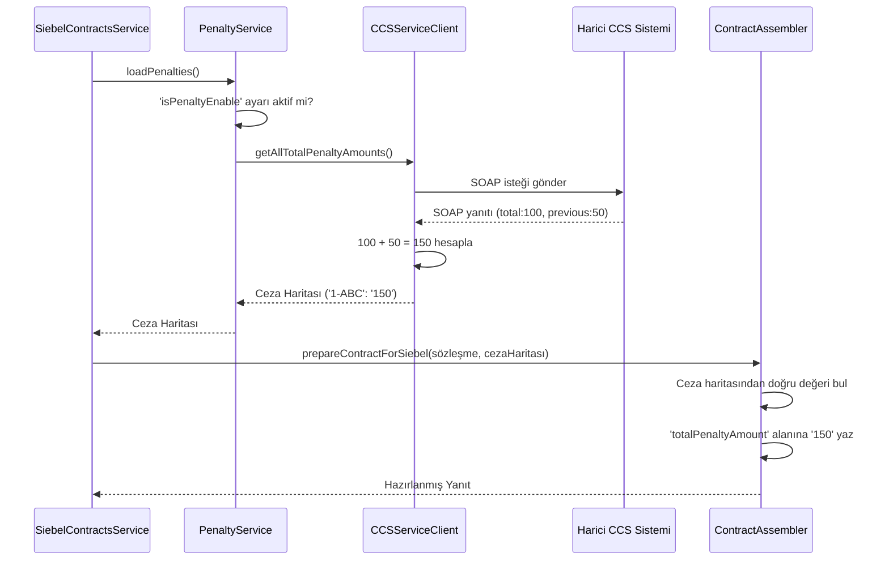

# Chapter 6: Cayma Bedeli Hesaplama (CCS Entegrasyonu)


Bir önceki bölüm olan [Yanıt Oluşturucular (Assemblers)](05_yanıt_oluşturucular__assemblers__.md) konusunda, sistemden topladığımız ham veriyi nasıl alıp kullanıcıya sunulacak şık ve anlamlı bir formata dönüştürdüğümüzü gördük. Bu "Assembler"ların hazırladığı sunumda kritik bir bilgi vardı: `totalPenaltyAmount`, yani sözleşmeden erken ayrılma durumunda ödenecek ceza tutarı.

Peki bu hassas ve önemli finansal bilgi, bizim uygulamamızın içinde mi hesaplanıyor? Eğer bir müşteri sözleşmesini bugün iptal etse, ne kadar ödemesi gerektiğini biz mi biliyoruz? Cevap hayır. Tıpkı büyük bir şirketin her konuda uzman olamaması gibi, bizim uygulamamız da her detayı bilemez. Özellikle finansal hesaplamalar gibi hassas konular için, bu işin uzmanı olan başka bir sisteme danışırız.

Bu bölümde, projemizin bu "uzman danışman" ile nasıl konuştuğunu, yani cayma bedelini hesaplamak için **CCS (Charging and Credit System)** adındaki harici bir sisteme nasıl entegre olduğunu keşfedeceğiz.

### Problem: Uzmanlık Gerektiren Bir Soru

Bir müşterinin sözleşme detaylarını gösterirken, ona "Eğer bu sözleşmeyi şimdi iptal edersen, X TL ceza ödemen gerekir" demek, kullanıcı deneyimi için çok değerli bir bilgidir. Ancak bu hesap oldukça karmaşıktır ve birçok faktöre bağlıdır:
*   Sözleşmenin ne kadarının tamamlandığı
*   Yapılan indirimler
*   Cihaz kampanyaları
*   Varsa önceki sözleşmeden devreden cezalar

Bizim uygulamamızın ana görevi sözleşmeleri bulup listelemektir, bu karmaşık finansal hesabı yapmak değil. Bu işi yanlış yapmak, müşteriye yanlış bilgi vermek anlamına gelir ki bu kabul edilemez.

Bu yüzden, bu soruyu sormamız gereken bir uzman var: **CCS**. Bizim görevimiz, müşterinin kim olduğunu CCS'e bildirmek ve ondan bu müşteriye ait tüm ceza bilgilerini almaktır.

### Uzman Danışmanla Konuşan Tercüman: `CCSServiceClient`

Uygulamamız ile CCS sistemi arasında bir "tercüman" veya "elçi" olması gerekir. Bu elçinin görevi, CCS'in anladığı dilde (SOAP ve XML) isteği hazırlamak, ona göndermek ve gelen cevabı bizim anlayacağımız Java diline çevirmektir. İşte bu kritik rolü `CCSServiceClient` üstlenir.

Bu istemcinin yaptığı en önemli işlerden biri, bir müşterinin tüm sözleşmeleri için ceza tutarlarını tek bir seferde getirmektir.

```java
// Dosya: src/main/java/com/vodafone/mcare/tariffoptions/extcall/soap/ccs/CCSServiceClient.java

public interface CCSServiceClient {
    // ...
    // Belirtilen müşteri için TÜM sözleşmelerin ceza tutarlarını bir harita (map) olarak getir.
    Map<String, String> getAllTotalPenaltyAmounts(String msisdn, SiebelCallContext scc, String languageId);
}
```

Bu metot, bize `Sözleşme ID'si -> Ceza Tutarı` şeklinde bir yapı döndürür. Örneğin, `{"1-ABC": "150.75", "1-DEF": "210.00"}` gibi. Bu sayede, elimizdeki her sözleşme için doğru ceza tutarını kolayca bulabiliriz.

### Akışın Kontrol Merkezi: `PenaltyService`

`CCSServiceClient` doğrudan Assembler'lar tarafından çağrılmaz. Bunun yerine, araya `PenaltyService` adında küçük bir kontrol katmanı koyarız. Bu servisin görevi basittir:
1.  `application.yml` dosyasındaki ayara bakarak "cayma bedeli özelliği aktif mi?" diye kontrol eder.
2.  Eğer aktifse, `CCSServiceClient`'ı çağırarak ceza tutarlarını yükler.
3.  Eğer aktif değilse, boş bir liste döndürerek CCS sistemini hiç yormaz.

```java
// Dosya: src/main/java/com/vodafone/mcare/tariffoptions/service/contract/PenaltyService.java

@Service
@RequiredArgsConstructor
public class PenaltyService {

    private final CCSServiceClient ccsServiceClient;
    private final ContractProperties contractProperties;

    public Map<String, String> loadPenalties(...) {
        // 1. Ayar dosyasını kontrol et, özellik kapalı mı?
        if (!contractProperties.isPenaltyEnable()) {
            return Collections.emptyMap(); // Kapalıysa boş harita dön.
        }
        // 2. Özellik açıksa, uzman istemciyi çağır.
        return ccsServiceClient.getAllTotalPenaltyAmounts(...);
    }
}
```

Bu yapı, bize büyük bir esneklik sağlar. Eğer CCS sisteminde bir bakım çalışması olursa, tek yapmamız gereken `application.yml` dosyasındaki bir ayarı değiştirmektir. Kodda hiçbir değişiklik yapmadan bu özelliği geçici olarak devre dışı bırakabiliriz.

### Perde Arkasındaki En Önemli Hesaplama

Bu bölümün en kritik detayı, CCS'ten gelen verinin nasıl işlendiğidir. CCS, bize tek bir ceza tutarı değil, bazen iki farklı türde ceza bilgisi gönderir:
1.  `totalPenaltyAmount`: Mevcut sözleşme için hesaplanan ana ceza tutarı.
2.  `previousAgreementPenalty`: Eğer varsa, bir önceki sözleşmeden devreden ceza tutarı.

Bizim görevimiz, müşteriye tek ve net bir rakam göstermektir. Bu yüzden `CCSServiceClientImpl`, bu iki değeri alıp **toplayarak** nihai cayma bedelini oluşturur.

Gelin bu sihrin gerçekleştiği koda bakalım:

```java
// Dosya: src/main/java/com/vodafone/mcare/tariffoptions/extcall/soap/ccs/CCSServiceClientImpl.java

private String calculateTotalPenaltyAmount(Agreement agreement) {
    // 1. Ana ceza tutarını al
    String totalPenaltyAmountValue = agreement.getTotalPenaltyAmount();
    // 2. Önceki sözleşmeden devreden cezayı al
    String previousAgreementPenaltyValue = getPreviousAgreementPenaltyValue(agreement);
    
    // Değerler boş olabilir, bunları güvenli bir şekilde sayıya çevir
    // Boş ise 0 kabul edilir.
    BigDecimal totalPenaltyAmount = parseAmount(totalPenaltyAmountValue);
    BigDecimal previousAgreementPenalty = parseAmount(previousAgreementPenaltyValue);
    
    // 3. İki değeri topla ve nihai sonucu oluştur!
    BigDecimal summedPenaltyAmount = totalPenaltyAmount.add(previousAgreementPenalty);
    
    return summedPenaltyAmount.stripTrailingZeros().toPlainString();
}
```

Bu metot, bu entegrasyonun kalbidir. İki farklı finansal kalemi birleştirerek, son kullanıcı için anlamlı olan tek bir "Toplam Cayma Bedeli" rakamını üretir. Burada `BigDecimal` kullanılması, `35.50 + 45.25 = 80.75` gibi kuruşlu hesaplamaların hatasız yapılmasını garantiler.

### Sürecin Görsel Akışı

Bu uzman danışmanlık sürecini bir diyagramla daha net görelim. Diyagramda `SiebelContractsService`'in özet bir yanıt (`COMPACT`) hazırladığını varsayalım:



Bu diyagram, adım adım ceza bilgisinin nasıl istendiğini, harici sistemden gelen iki farklı değerin nasıl birleştirildiğini ve son olarak [Yanıt Oluşturucular (Assemblers)](05_yanıt_oluşturucular__assemblers__.md) tarafından nihai yanıta nasıl eklendiğini gösterir.

### Sonuç ve Genel Bakış

Bu bölümde, projemizin kendisinin bilmediği uzmanlık gerektiren bir bilgiyi (cayma bedeli) nasıl harici bir sistemden temin ettiğini öğrendik.

*   **Delegasyon Güçtür:** Karmaşık ve kritik hesaplamalar, bu işin uzmanı olan sistemlere (CCS) devredilir. Bu, bizim kodumuzu daha basit ve odaklanmış tutar.
*   **`CCSServiceClient` Elçimizdir:** Bu istemci, harici sistemle iletişim kurmanın tüm teknik detaylarını (SOAP, XML) yönetir.
*   **Veri İşleme Kritik Öneme Sahiptir:** Harici sistemden gelen veri her zaman doğrudan kullanılmaz. Bizim durumumuzda, `totalPenaltyAmount` ve `previousAgreementPenalty` alanlarını toplayarak son kullanıcı için daha anlamlı bir değer üretiyoruz.
*   **Yapılandırma Esneklik Sağlar:** `PenaltyService` içindeki basit bir `if` kontrolü ve `application.yml`'deki bir ayar sayesinde, bu entegrasyonu gerektiğinde kolayca açıp kapatabiliriz.

---

### Eğitimin Sonu: Tebrikler!

Bu bölümle birlikte `ms-tariff-options` projesinin kalbine yaptığımız yolculuğun sonuna geldik. Tebrikler!

Bu eğitim serisi boyunca, basit bir "sözleşmelerimi getir" isteğinin arka planda ne kadar karmaşık ve akıllı bir maceraya dönüştüğünü adım adım keşfettik:
1.  İsteğin ilk olarak nasıl karşılandığını ve kaynağına göre **yönlendirildiğini** gördük.
2.  Modern kanallar için verinin, önbellekten başlayarak yavaş sistemlere doğru giden akıllı bir **zincirde** nasıl arandığını öğrendik.
3.  Eski sistemlerle konuşmak için nasıl bir **tercümanlık** yapıldığını anladık.
4.  Gelen dağınık sözleşme listesinin, iş kurallarına göre nasıl mantıklı bir şekilde **sıralandığını** inceledik.
5.  Teknik verinin, son kullanıcı için anlamlı metinler ve formatlarla nasıl şık bir sunuma **dönüştürüldüğünü** gördük.
6.  Ve son olarak, uzmanlık gerektiren finansal bilgilerin harici bir sisteme danışılarak nasıl **hesaplandığına** tanık olduk.

Artık bu projenin temel mimarisini, ana bileşenlerini ve bu bileşenlerin birbiriyle nasıl uyum içinde çalışarak tek bir amaca hizmet ettiğini biliyorsunuz. Bu bilgi, projedeki mevcut kodu anlamanız, yeni özellikler geliştirmeniz veya olası sorunları çözmeniz için size sağlam bir temel sağlayacaktır.

---

Generated by [AI Codebase Knowledge Builder](https://github.com/The-Pocket/Tutorial-Codebase-Knowledge)