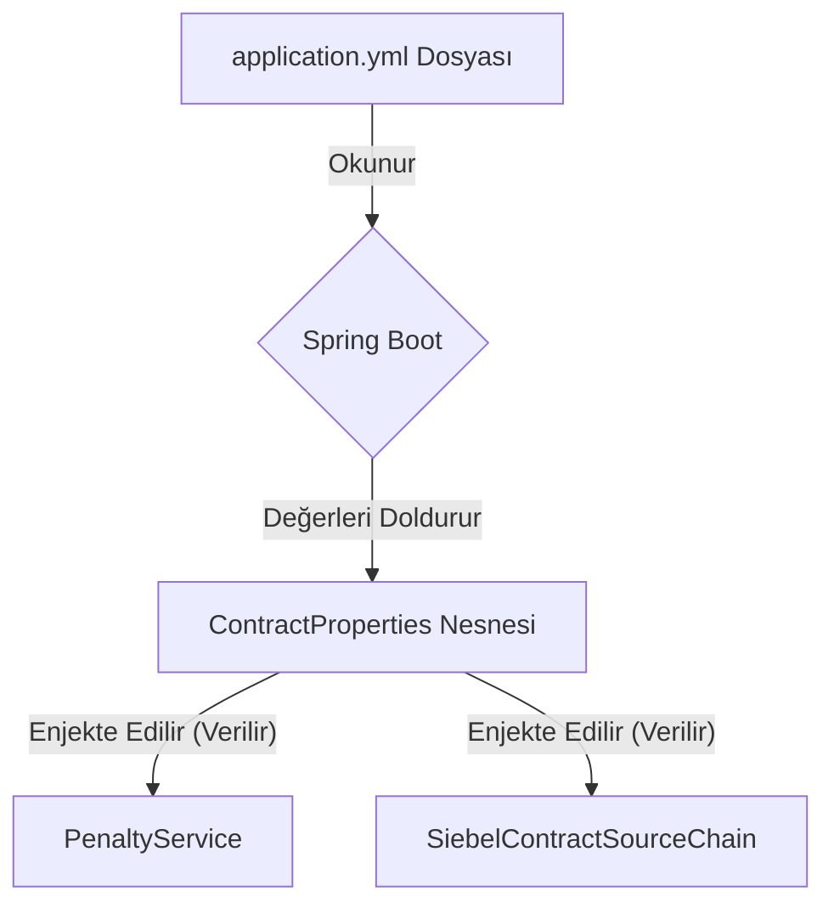

# Chapter 6: Yapılandırma (Configuration) Odaklı Davranış


Önceki bölümde, farklı kaynaklardan topladığımız ham verileri bir "usta aşçı" gibi işleyerek son kullanıcı için anlamlı ve zengin bir yanıta nasıl dönüştürdüğümüzü öğrendik. Bu [Yanıt (Response) Oluşturma ve Zenginleştirme](05_yanıt__response__oluşturma_ve_zenginleştirme_.md) süreciyle birlikte, bir isteğin baştan sona tüm yolculuğunu tamamlamış olduk.

Peki, bu yolculuk boyunca karşılaştığımız "Eğer ceza sorgulama aktifse...", "Siebel kaynaklarını şu sırayla dene..." gibi kritik karar anlarını yöneten gizli bir güç merkezi var mı? Evet var! Bu son bölümde, projemizin beyni ve kontrol paneli olan yapılandırma (konfigürasyon) mekanizmasını keşfedeceğiz.

## Neden Bir "Kontrol Paneline" İhtiyacımız Var?

Modern bir akıllı televizyon düşünün. Görüntü ayarlarını (parlaklık, kontrast), ses modunu (sinema, müzik) veya internet bağlantısını değiştirmek istediğinizde ne yaparsınız? Televizyonun arkasını açıp lehim mi yaparsınız? Elbette hayır. Uzaktan kumandayı alır, "Ayarlar" menüsüne girer ve tüm bu davranışları birkaç tuşa basarak değiştirirsiniz.

İşte bizim uygulamamız da tıpkı bu akıllı televizyon gibi çalışır. Uygulamanın temel davranışları, kodun içine sabit bir şekilde yazılmaz. Bunun yerine, `application.yml` adını verdiğimiz bir "ayarlar menüsü" dosyasından okunur. Bu dosya, uygulamanın kontrol panelidir ve bize kodu değiştirmeden, hatta uygulamayı yeniden derlemeden davranışını şekillendirme gücü verir.

Bu bölümün amacı, bu kontrol panelinin nasıl çalıştığını ve uygulamanın akışını nasıl bu kadar esnek hale getirdiğini anlamaktır.

## Kontrol Paneli: `application.yml` Dosyası

Projemizin kalbindeki kontrol paneli, `src/main/resources/application.yml` yolunda bulunan metin dosyasıdır. Bu dosya, basit ve okunabilir bir formatta, uygulamanın çalışması için gerekli tüm ayarları, şifreleri ve davranış kurallarını içerir.

Bu dosyada bizi ilgilendiren `contract-properties` adında özel bir bölüm bulunur. Bu bölüm, özellikle sözleşme bulma akışımızın davranışlarını kontrol eder.

```yaml
# Dosya: src/main/resources/application.yml

contract-properties:
  penalty-enable: true
  use-ccb-850: true
  siebel-source-order:
    - dds
    - csm
    - tmf651
    - siebel_soap
```

Bu basit metin parçası, uygulamaya çok güçlü komutlar verir:
*   `penalty-enable: true`: "Cayma bedeli (ceza) sorgulama özelliği **açık**."
*   `use-ccb-850: true`: "Legacy (CCB) akışında **850** numaralı servisi kullan."
*   `siebel-source-order`: "Siebel akışında veri ararken **önce `dds`'e, sonra `csm`'e...** bak."

Eğer yarın bir gün ceza servisinde bir sorun yaşanırsa, bir sistem yöneticisinin tek yapması gereken bu dosyayı açıp `penalty-enable` değerini `false` yapmak ve uygulamayı yeniden başlatmaktır. Koda tek bir satır bile dokunmaya gerek kalmaz!

## Ayarlar Koda Nasıl Aktarılıyor?

Peki bu metin dosyasındaki ayarlar, sihirli bir şekilde Java kodunun içine nasıl giriyor? Bu işi, Spring Boot çerçevesinin sağladığı bir mekanizma yapar. Süreç oldukça basittir:

1.  **Ayar Taşıyıcısı Sınıf (`ContractProperties`):** Önce, `application.yml` dosyasındaki ayarları tutacak bir Java sınıfı oluşturulur. Bu sınıf, dosyadaki her bir ayar için bir değişkene sahiptir.

```java
// Dosya: src/main/java/com/vodafone/mcare/tariffoptions/properties/ContractProperties.java

@Configuration
@ConfigurationProperties(prefix = "contract-properties") // Bu sınıfa "contract-properties" başlığındaki ayarları yükle
public class ContractProperties {
    private boolean penaltyEnable = true; // penalty-enable değerini tutar
    private boolean useCcb850 = true;     // use-ccb-850 değerini tutar
    private List<SiebelContractSourceType> siebelSourceOrder; // siebel-source-order listesini tutar
    // ...
}
```
`@ConfigurationProperties(prefix = "contract-properties")` notasyonu, Spring'e şu komutu verir: "Uygulama başladığında `application.yml` dosyasını aç, `contract-properties` ile başlayan bölümü bul ve oradaki tüm değerleri bu sınıfın ilgili değişkenlerine otomatik olarak ata."

2.  **Ayarların Servislere Enjekte Edilmesi:** Bu `ContractProperties` sınıfı artık içi doldurulmuş bir "ayar kutusu" gibidir. Uygulamanın herhangi bir yerinde bu ayarlara ihtiyaç duyulduğunda, bu kutu oraya "enjekte edilir" (verilir).

Bu süreci bir şema ile görelim:



### Örnek 1: Açma/Kapama Düğmesi (`penalty-enable`)

[Cayma Bedeli (Ceza) Entegrasyonu](04_cayma_bedeli__ceza__entegrasyonu_.md) bölümünde gördüğümüz `PenaltyService`'in, bu ayarı nasıl kullandığını hatırlayalım.

```java
// Dosya: src/main/java/com/vodafone/mcare/tariffoptions/service/contract/PenaltyService.java

@Service
public class PenaltyService {

    private final CCSServiceClient ccsServiceClient;
    private final ContractProperties contractProperties; // Ayar kutusu buraya enjekte edildi!

    public Map<String, String> loadPenalties(...) {
        // Kontrol panelindeki düğme kapalı mı?
        if (!contractProperties.isPenaltyEnable()) {
            return Collections.emptyMap(); // Evet, o zaman hiçbir şey yapma.
        }
        
        // Düğme açıksa, normal çalışmaya devam et.
        return ccsServiceClient.getAllTotalPenaltyAmounts(...);
    }
}
```
Bu `if` koşulu, kodun davranışını doğrudan yapılandırma dosyasına bağlar. `penalty-enable` değerini değiştirmek, bu `if` bloğunun sonucunu değiştirir.

### Örnek 2: Sıralama Listesi (`siebel-source-order`)

Daha da güçlü bir örnek, [Siebel Veri Kaynağı Zinciri](03_siebel_veri_kaynağı_zinciri_.md) bölümünde gördüğümüz arama sırasıdır. `SiebelContractSourceChain` servisi, hangi dedektifi hangi sırayla göndereceğine karar vermek için doğrudan bu yapılandırmaya bakar.

```java
// Dosya: src/main/java/com/vodafone/mcare/tariffoptions/service/contract/SiebelContractSourceChain.java

@Service
public class SiebelContractSourceChain {

    private final ContractProperties contractProperties; // Ayar kutusu burada da var!
    // ...

    public List<SiebelContract> fetch(...) {
        // Arama sırasını doğrudan ayar kutusundan al!
        List<SiebelContractSourceType> order = contractProperties.getSiebelSourceOrder();
        
        for (SiebelContractSourceType type : order) {
            // ... bu sıraya göre kaynakları dolaş ...
        }
        // ...
    }
}
```
Eğer `application.yml` dosyasındaki listenin sırasını `csm, dds, siebel_soap, tmf651` olarak değiştirirsek, kod anında bu yeni stratejiyi uygulamaya başlar. Bu, uygulamanın performansını optimize etmek veya geçici olarak sorunlu bir sistemi atlamak için inanılmaz bir esneklik sağlar.

## Özet ve Serinin Sonu

Bu bölümde, projemizin en temel tasarım prensiplerinden birini öğrendik:

*   **Davranışı Koddan Ayırmak:** Kritik iş kararları (bir özelliğin aktif olup olmadığı, servislerin hangi sırayla çağrılacağı vb.) kodun içine sabitlenmemelidir.
*   **`application.yml` Kontrol Panelidir:** Bu dosya, uygulamanın davranışını yöneten merkezi bir "ayarlar menüsü" görevi görür.
*   **`@ConfigurationProperties`:** Bu güçlü notasyon, YAML dosyasındaki ayarları otomatik olarak Java sınıflarına bağlayarak kod içinde kolayca kullanılabilir hale getirir.
*   **Esneklik ve Yönetilebilirlik:** Bu yaklaşım sayesinde, kodu değiştirmeden uygulamanın çalışma şeklini anında uyarlayabiliriz. Bu, özellikle büyük ve dinamik sistemlerde bakım ve yönetimi büyük ölçüde kolaylaştırır.

### Genel Özet

Bu eğitim serisi boyunca `ms-tariff-options` servisinin iç dünyasında bir yolculuğa çıktık. Bu yolculukta:
1.  Gelen bir isteğin bir **trafik polisi** gibi nasıl karşılanıp doğru yola yönlendirildiğini gördük.
2.  Eski sistemlerle konuşan **Legacy (CCB) akışının** nasıl bir "arkeolog" gibi çalıştığını öğrendik.
3.  Modern ve esnek **Siebel Veri Kaynağı Zinciri'nin** bir "dedektif ekibi" gibi veriyi nasıl bulduğunu keşfettik.
4.  Farklı bir uzmanlık alanı olan **cayma bedeli sorgulamanın** ana akışa nasıl entegre edildiğini anladık.
5.  Toplanan tüm ham verilerin **Assembler** ve **Enricher**'lar ile nasıl son kullanıcıya hazır, şık bir yanıta dönüştüğünü izledik.
6.  Ve son olarak, tüm bu karmaşık davranışın tek bir **yapılandırma dosyası** ile nasıl yönetildiğini öğrendik.

Umarız bu seri, `ms-tariff-options` servisinin nasıl çalıştığını anlamanızda size yardımcı olmuştur. Artık kodun farklı parçalarının bir araya gelerek nasıl anlamlı bir bütün oluşturduğunu daha iyi anlıyorsunuz. Tebrikler

---

Generated by [AI Codebase Knowledge Builder](https://github.com/The-Pocket/Tutorial-Codebase-Knowledge)