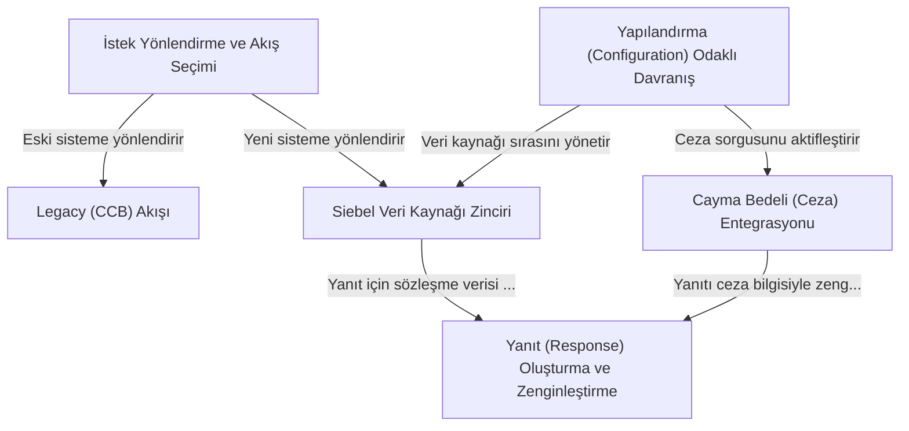

# Tutorial: ms-tariff-options-master@f5090668355

Bu proje, bir müşterinin **mevcut sözleşme bilgilerini** getiren bir servistir. Sistemin en önemli özelliği, gelen isteğin *eski* mi yoksa *yeni* bir müşteriden mi geldiğini anlayarak, isteği doğru iş akışına yönlendirmesidir. Yeni sistemler için, doğru veriyi bulana kadar farklı veri kaynaklarını sırayla dener. Son olarak, ham veriyi alıp üzerine *cayma bedeli* gibi ek bilgiler ekleyerek ve metin şablonlarıyla zenginleştirerek kullanıcıya anlaşılır bir yanıt oluşturur. Servisin davranışları, kod içerisinden değil, **merkezi bir yapılandırma dosyası** üzerinden kolayca yönetilebilir.

**Source Repository:** [None](None)

## Chapters

1. [İstek Yönlendirme ve Akış Seçimi
](01_i̇stek_yönlendirme_ve_akış_seçimi_.md)
2. [Legacy (CCB) Akışı
](02_legacy__ccb__akışı_.md)
3. [Siebel Veri Kaynağı Zinciri
](03_siebel_veri_kaynağı_zinciri_.md)
4. [Cayma Bedeli (Ceza) Entegrasyonu
](04_cayma_bedeli__ceza__entegrasyonu_.md)
5. [Yanıt (Response) Oluşturma ve Zenginleştirme
](05_yanıt__response__oluşturma_ve_zenginleştirme_.md)
6. [Yapılandırma (Configuration) Odaklı Davranış
](06_yapılandırma__configuration__odaklı_davranış_.md)

---

Generated by [AI Codebase Knowledge Builder](https://github.com/The-Pocket/Tutorial-Codebase-Knowledge)
