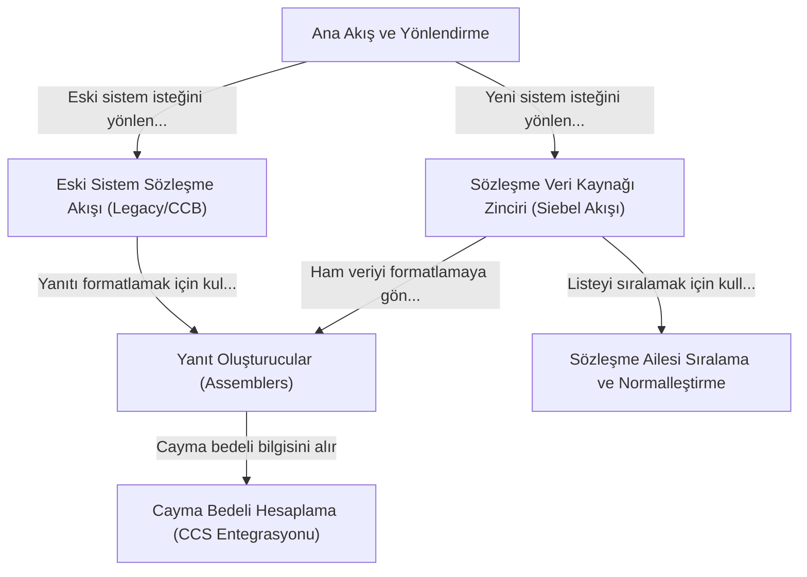

# Tutorial: ms-tariff-options-master@f5090668355

Bu proje, bir müşterinin aktif sözleşmelerini getiren bir mikroservistir. Bir talep geldiğinde, önce talebin *yeni dijital kanallardan mı* yoksa *eski sistemlerden mi* geldiğini kontrol ederek doğru iş akışını başlatır. Yeni sistemler için, sözleşme verisini bulmak amacıyla önce hızlı önbellek gibi farklı kaynakları akıllıca dener. Ayrıca, başka bir sisteme bağlanarak sözleşmeden erken ayrılma durumunda oluşacak **cayma bedelini** de hesaplayabilir. Son olarak, tüm teknik verileri alıp kullanıcı için *özet* veya *detaylı* olacak şekilde anlaşılır bir yanıta dönüştürür.

**Source Repository:** [None](None)

## Chapters

1. [Ana Akış ve Yönlendirme
](./01_ana_akış_ve_yönlendirme_.md)
2. [Sözleşme Veri Kaynağı Zinciri (Siebel Akışı)
](dev-friendly/02_sözleşme_veri_kaynağı_zinciri__siebel_akışı__.md)
3. [Eski Sistem Sözleşme Akışı (Legacy/CCB)
](dev-friendly/03_eski_sistem_sözleşme_akışı__legacy_ccb__.md)
4. [Sözleşme Ailesi Sıralama ve Normalleştirme
](dev-friendly/04_sözleşme_ailesi_sıralama_ve_normalleştirme_.md)
5. [Yanıt Oluşturucular (Assemblers)
](dev-friendly/05_yanıt_oluşturucular__assemblers__.md)
6. [Cayma Bedeli Hesaplama (CCS Entegrasyonu)
](dev-friendly/06_cayma_bedeli_hesaplama__ccs_entegrasyonu__.md)

---

Generated by [AI Codebase Knowledge Builder](https://github.com/The-Pocket/Tutorial-Codebase-Knowledge)
